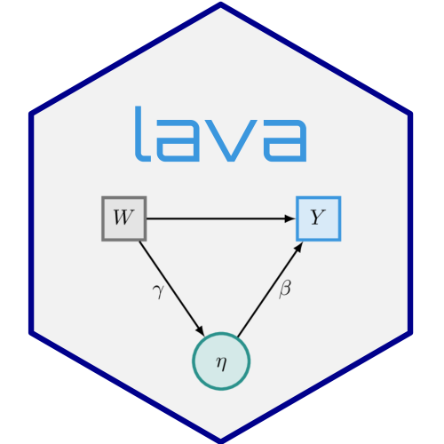

---
output:
  github_document:
  toc: true
  toc_depth: 2
---

<!-- badges: start -->
  [](https://github.com/kkholst/lava/actions/workflows/R-CMD-check.yaml)
  [](https://codecov.io/github/kkholst/lava?branch=main)
  [](https://CRAN.R-project.org/package=lava)
  [](https://cranlogs.r-pkg.org/downloads/total/last-month/lava)
[](https://app.codecov.io/gh/kkholst/lava)

<!-- badges: end -->

```{r include=FALSE}
options(family="Times")
knitr::opts_chunk$set(
  collapse = TRUE,
  comment = "#>",
  cache = TRUE,
  dev = "svg",
  fig.ext = "svg",
  fig.path = "man/figures/",
  out.width = "70%"
)
```


# Latent Variable Models: `lava` <a href="https://kkholst.github.io/lava/"></a>

A general implementation of Structural Equation Models with latent variables
(MLE, 2SLS, and composite likelihood estimators) with both continuous, censored,
and ordinal outcomes (Holst and Budtz-Joergensen (2013)
<10.1007/s00180-012-0344-y>). Mixture latent variable models and non-linear
latent variable models (Holst and Budtz-Joergensen (2020)
<10.1093/biostatistics/kxy082>). The package also provides methods for graph
exploration (d-separation, back-door criterion), simulation of general
non-linear latent variable models, and estimation of influence functions for a
broad range of statistical models.


## Installation

```{r}
#| eval: FALSE
install.packages("lava", dependencies=TRUE)
library("lava")
demo("lava")
```

For graphical capabilities the `Rgraphviz` package is needed (first install the `BiocManager` package)

```{r}
#| eval: FALSE
# install.packages("BiocManager")
BiocManager::install("Rgraphviz")
```

or the `igraph` or `visNetwork` packages

```{r}
#| eval: FALSE
install.packages("igraph")
install.packages("visNetwork")
```

The development version of `lava` may also be installed directly from `github`:

```{r}
#| eval: FALSE
# install.packages("remotes")
remotes::install_github("kkholst/lava")
```

## Citation

To cite that `lava` package please use one of the following references

> Klaus K. Holst and Esben Budtz-Joergensen (2013).
> Linear Latent Variable Models: The lava-package.
> Computational Statistics 28 (4), pp 1385-1453.
> <http://dx.doi.org/10.1007/s00180-012-0344-y>

    @article{lava,
      title = {Linear Latent Variable Models: The lava-package},
      author = {Klaus Kähler Holst and Esben Budtz-Jørgensen},
      year = {2013},
      volume = {28},
      number = {4},
      pages = {1385-1452},
      journal = {Computational Statistics},
      doi = {10.1007/s00180-012-0344-y}
    }

> Klaus K. Holst and Esben Budtz-Jørgensen (2020). A two-stage estimation
> procedure for non-linear structural equation models. Biostatistics 21 (4), pp 676-691.
> <http://dx.doi.org/10.1093/biostatistics/kxy082>

    @article{lava_nlin,
      title = {A two-stage estimation procedure for non-linear structural equation models},
      author = {Klaus Kähler Holst and Esben Budtz-Jørgensen},
      journal = {Biostatistics},
      year = {2020},
      volume = {21},
      number = {4},
      pages = {676-691},
      doi = {10.1093/biostatistics/kxy082},
    }


## Examples

```{r}
#| results: 'hide'
#| echo: FALSE
library(lava)
```

### Influence functions

    2+2

    ```{r}
    2+2
    ```


### Structural Equation Model

Specify structural equation models with two factors

```{r}
#| label: lvm1
#| warning: FALSE
#| message: FALSE
#| fig.align: 'center'
m <- lvm()
regression(m) <- y1 + y2 + y3 ~ eta1
regression(m) <- z1 + z2 + z3 ~ eta2
latent(m) <- ~ eta1 + eta2
regression(m) <- eta2 ~ eta1 + x
regression(m) <- eta1 ~ x
    
labels(m) <- c(eta1=expression(eta[1]), eta2=expression(eta[2]))
plot(m)
```

Simulation

```{r}
d <- sim(m, 100, seed=1)
```

Estimation

```{r}
e <- estimate(m, d)
e
```


### Model assessment

Assessing goodness-of-fit, here the linearity between eta2 and eta1 (requires the `gof` package)

```{r}
#| label: gof1
#| message: FALSE
#| fig.align: 'center'
# install.packages("gof", repos="https://kkholst.github.io/r_repo/")
library("gof")
set.seed(1)
g <- cumres(e, eta2 ~ eta1)
plot(g)
```

### Non-linear measurement error model

Simulate non-linear model

```{r}
m <- lvm(y1 + y2 + y3 ~ u, u ~ x)
transform(m,u2 ~ u) <- function(x) x^2
regression(m) <- z~u2+u

d <- sim(m,200,p=c("z"=-1, "z~u2"=-0.5), seed=1)
```

Stage 1:

```{r}
m1 <- lvm(c(y1[0:s], y2[0:s], y3[0:s]) ~ 1*u, u ~ x)
latent(m1) <- ~ u
(e1 <- estimate(m1, d))
```

Stage 2

```{r}
pp <- function(mu,var,data,...) cbind(u=mu[,"u"], u2=mu[,"u"]^2+var["u","u"])
(e <- measurement.error(e1, z~1+x, data=d, predictfun=pp))
```


```{r}
#| label: nlin1
#| message: FALSE
#| fig.align: 'center'
f <- function(p) p[1]+p["u"]*u+p["u2"]*u^2
u <- seq(-1, 1, length.out=100)
plot(e, f, data=data.frame(u))
```


### Simulation

Studying the small-sample properties of a mediation analysis


```{r}
m <- lvm(y~x, c~1)
regression(m) <- y+x ~ z
eventTime(m) <- t~min(y=1, c=0)
transform(m,S~t+status) <- function(x) survival::Surv(x[,1],x[,2])
```

plot(m)

```{r}
#| label: mediation1
#| message: FALSE
#| fig.align: 'center'
plot(m)
```

Simulate from model and estimate indirect effects

```{r}
#| label: sim1
#| cache: TRUE
future::plan("multicore") # parallelization via future
## progressr::handlers(global=TRUE) # add progress-bar
onerun <- function(...) {
  d <- sim(m, 100)
  m0 <- lvm(S~x+z, x~z)
  e <- estimate(m0, d, estimator="glm")
  vec(summary(effects(e, S~z))$coef[,1:2])
}
val <- sim(onerun, 100)
summary(val, estimate=1:4, se=5:8, short=TRUE)
```

Add additional simulations and visualize results

```{r}
#| label: simres1
#| cache: TRUE
#| message: FALSE
#| fig.align: 'center'
val <- sim(val,500) ## Add 500 simulations
plot(val, estimate=c("Total.Estimate", "Indirect.Estimate"),
     true=c(2, 1), se=c("Total.Std.Err", "Indirect.Std.Err"),
     scatter.plot=TRUE)
```
