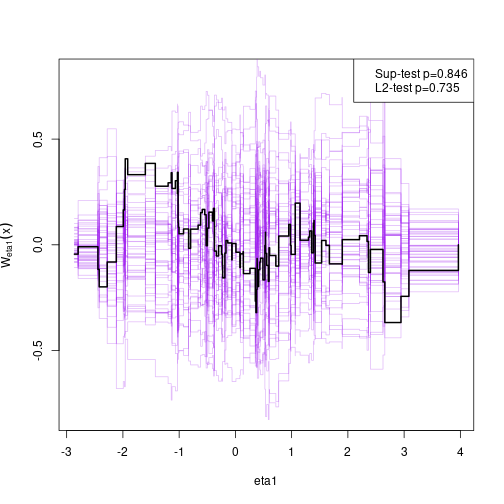

<!-- badges: start -->
  [](https://github.com/kkholst/lava/actions)
  [](https://codecov.io/github/kkholst/lava?branch=main)
  [](https://CRAN.R-project.org/package=lava)
  [](https://cranlogs.r-pkg.org/downloads/total/last-month/lava)
<!-- badges: end -->


# Latent Variable Models: `lava` 

A general implementation of Structural Equation Models with latent variables
(MLE, 2SLS, and composite likelihood estimators) with both continuous, censored,
and ordinal outcomes (Holst and Budtz-Joergensen (2013)
<10.1007/s00180-012-0344-y>). 
Mixture latent variable models and non-linear
latent variable models (Holst and Budtz-Joergensen (2020)
<10.1093/biostatistics/kxy082>). The package also provides methods for graph
exploration (d-separation, back-door criterion), simulation of general
non-linear latent variable models, and estimation of influence functions for a
broad range of statistical models.


## Installation


```r
install.packages("lava", dependencies=TRUE)
library("lava")
demo("lava")
```

For graphical capabilities the `Rgraphviz` package is needed (first install the `BiocManager` package)


```r
# install.packages("BiocManager")
BiocManager::install("Rgraphviz")
```

or the `igraph` or `visNetwork` packages


```r
install.packages("igraph")
install.packages("visNetwork")
```

The development version of `lava` may also be installed directly from `github`:


```r
# install.packages("remotes")
remotes::install_github("kkholst/lava")
```


## Citation

To cite that `lava` package please use one of the following references

> Klaus K. Holst and Esben Budtz-Joergensen (2013).
> Linear Latent Variable Models: The lava-package.
> Computational Statistics 28 (4), pp 1385-1453.
> <http://dx.doi.org/10.1007/s00180-012-0344-y>

    @article{lava,
      title = {Linear Latent Variable Models: The lava-package},
      author = {Klaus Kähler Holst and Esben Budtz-Jørgensen},
      year = {2013},
      volume = {28},
      number = {4},
      pages = {1385-1452},
      journal = {Computational Statistics},
      doi = {10.1007/s00180-012-0344-y}
    }

> Klaus K. Holst and Esben Budtz-Jørgensen (2020). A two-stage estimation
> procedure for non-linear structural equation models. Biostatistics 21 (4), pp 676-691.
> <http://dx.doi.org/10.1093/biostatistics/kxy082>

    @article{lava_nlin,
      title = {A two-stage estimation procedure for non-linear structural equation models},
      author = {Klaus Kähler Holst and Esben Budtz-Jørgensen},
      journal = {Biostatistics},
      year = {2020},
      volume = {21},
      number = {4},
      pages = {676-691},
      doi = {10.1093/biostatistics/kxy082},
    }


## Examples


### Structural Equation Model

Specify structural equation models with two factors


```r
m <- lvm()
regression(m) <- y1 + y2 + y3 ~ eta1
regression(m) <- z1 + z2 + z3 ~ eta2
latent(m) <- ~ eta1 + eta2
regression(m) <- eta2 ~ eta1 + x
regression(m) <- eta1 ~ x

labels(m) <- c(eta1=expression(eta[1]), eta2=expression(eta[2]))
plot(m)
```


Simulation


```r
d <- sim(m, 100, seed=1)
```

Estimation


```r
e <- estimate(m, d)
e
#>                     Estimate Std. Error  Z-value   P-value
#> Measurements:                                             
#>    y2~eta1           0.95462    0.08083 11.80993    <1e-12
#>    y3~eta1           0.98476    0.08922 11.03722    <1e-12
#>     z2~eta2          0.97038    0.05368 18.07714    <1e-12
#>     z3~eta2          0.95608    0.05643 16.94182    <1e-12
#> Regressions:                                              
#>    eta1~x            1.24587    0.11486 10.84694    <1e-12
#>     eta2~eta1        0.95608    0.18008  5.30910 1.102e-07
#>     eta2~x           1.11495    0.25228  4.41951 9.893e-06
#> Intercepts:                                               
#>    y2               -0.13896    0.12458 -1.11537    0.2647
#>    y3               -0.07661    0.13869 -0.55241    0.5807
#>    eta1              0.15801    0.12780  1.23644    0.2163
#>    z2               -0.00441    0.14858 -0.02969    0.9763
#>    z3               -0.15900    0.15731 -1.01076    0.3121
#>    eta2             -0.14143    0.18380 -0.76949    0.4416
#> Residual Variances:                                       
#>    y1                0.69684    0.14858  4.69004          
#>    y2                0.89804    0.16630  5.40026          
#>    y3                1.22456    0.21182  5.78109          
#>    eta1              0.93620    0.19623  4.77084          
#>    z1                1.41422    0.26259  5.38570          
#>    z2                0.87569    0.19463  4.49934          
#>    z3                1.18155    0.22640  5.21883          
#>    eta2              1.24430    0.28992  4.29195
```


### Model assessment

Assessing goodness-of-fit, here the linearity between eta2 and eta1 (requires the `gof` package)


```r
# install.packages("gof", repos="https://kkholst.github.io/r_repo/")
library("gof")
set.seed(1)
g <- cumres(e, eta2 ~ eta1)
plot(g)
```




### Non-linear measurement error model

Simulate non-linear model


```r
m <- lvm(y1 + y2 + y3 ~ u, u ~ x)
transform(m,u2 ~ u) <- function(x) x^2
regression(m) <- z~u2+u

d <- sim(m,200,p=c("z"=-1, "z~u2"=-0.5), seed=1)
```

Stage 1:


```r
m1 <- lvm(c(y1[0:s], y2[0:s], y3[0:s]) ~ 1*u, u ~ x)
latent(m1) <- ~ u
(e1 <- estimate(m1, d))
#>                     Estimate Std. Error  Z-value  P-value
#> Regressions:                                             
#>    u~x               1.06998    0.08208 13.03542   <1e-12
#> Intercepts:                                              
#>    u                -0.08871    0.08753 -1.01344   0.3108
#> Residual Variances:                                      
#>    y1                1.00054    0.07075 14.14214         
#>    u                 1.19873    0.15503  7.73233
```

Stage 2


```r
pp <- function(mu,var,data,...) cbind(u=mu[,"u"], u2=mu[,"u"]^2+var["u","u"])
(e <- measurement.error(e1, z~1+x, data=d, predictfun=pp))
#>             Estimate Std.Err    2.5%   97.5%   P-value
#> (Intercept)  -1.1181 0.13795 -1.3885 -0.8477 5.273e-16
#> x            -0.0537 0.13213 -0.3127  0.2053 6.844e-01
#> u             1.0039 0.11504  0.7785  1.2294 2.609e-18
#> u2           -0.4718 0.05213 -0.5740 -0.3697 1.410e-19
```


```r
f <- function(p) p[1]+p["u"]*u+p["u2"]*u^2
u <- seq(-1, 1, length.out=100)
plot(e, f, data=data.frame(u))
```


### Simulation

Studying the small-sample properties of a mediation analysis


```r
m <- lvm(y~x, c~1)
regression(m) <- y+x ~ z
eventTime(m) <- t~min(y=1, c=0)
transform(m,S~t+status) <- function(x) survival::Surv(x[,1],x[,2])
```


```r
plot(m)
```


Simulate from model and estimate indirect effects


```r
onerun <- function(...) {
    d <- sim(m, 100)
    m0 <- lvm(S~x+z, x~z)
    e <- estimate(m0, d, estimator="glm")
    vec(summary(effects(e, S~z))$coef[,1:2])
}
val <- sim(onerun, 100)
summary(val, estimate=1:4, se=5:8, short=TRUE)
#> 100 replications					Time: 3.667s
#> 
#>         Total.Estimate Direct.Estimate Indirect.Estimate S~x~z.Estimate
#> Mean           1.97292         0.96537           1.00755        1.00755
#> SD             0.16900         0.18782           0.15924        0.15924
#> SE             0.18665         0.18090           0.16431        0.16431
#> SE/SD          1.10446         0.96315           1.03183        1.03183
#>                                                                        
#> Min            1.47243         0.54497           0.54554        0.54554
#> 2.5%           1.63496         0.61228           0.64914        0.64914
#> 50%            1.95574         0.97154           0.99120        0.99120
#> 97.5%          2.27887         1.32443           1.27807        1.27807
#> Max            2.45746         1.49491           1.33446        1.33446
#>                                                                        
#> Missing        0.00000         0.00000           0.00000        0.00000
```

Add additional simulations and visualize results


```r
val <- sim(val,500) ## Add 500 simulations
plot(val, estimate=c("Total.Estimate", "Indirect.Estimate"),
     true=c(2, 1), se=c("Total.Std.Err", "Indirect.Std.Err"),
     scatter.plot=TRUE)
```


