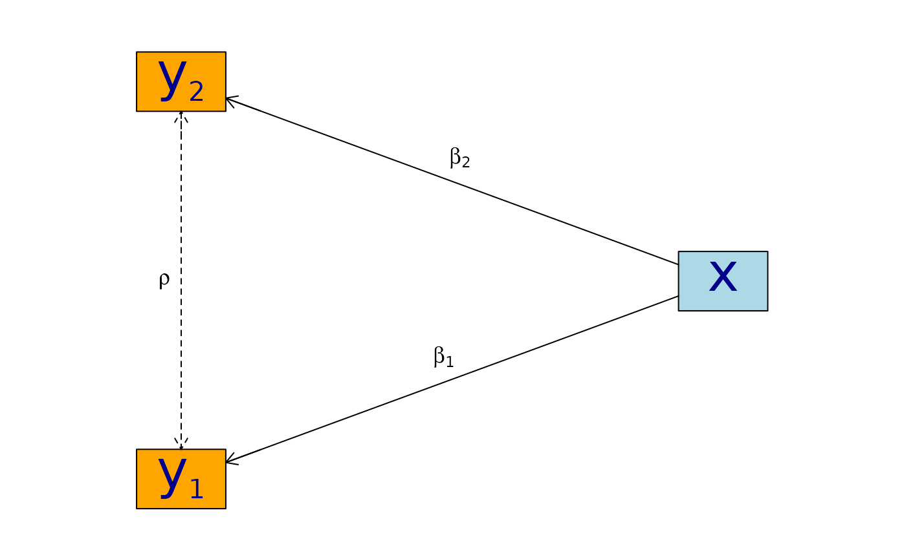

# Estimating partial correlations with lava

This document illustrates how to estimate partial correlation
coefficients using `lava`.

Assume that $Y_{1}$ and $Y_{2}$ are conditionally normal distributed
given $\mathbf{X}$ with the following linear structure
$$Y_{1} = {\mathbf{β}}_{1}^{t}\mathbf{X} + \epsilon_{1}$$$$Y_{2} = {\mathbf{β}}_{2}^{t}\mathbf{X} + \epsilon_{2}$$
with covariates $\mathbf{X} = \left( X_{1},\ldots,X_{k} \right)^{t}$ and
measurement errors $$\begin{pmatrix}
\epsilon_{1} \\
\epsilon_{2}
\end{pmatrix} \sim \mathcal{N}(0,\mathbf{\Sigma}),\quad\mathbf{\Sigma} = \begin{pmatrix}
\sigma_{1}^{2} & {\rho\sigma_{1}\sigma_{2}} \\
{\rho\sigma_{1}\sigma_{2}} & \sigma_{2}^{2}
\end{pmatrix}.$$

``` r
library('lava')
m0 <- lvm(y1+y2 ~ x, y1 ~~ y2)
edgelabels(m0, y1 + y2 ~ x) <- c(expression(beta[1]), expression(beta[2]))
edgelabels(m0, y1 ~ y2) <- expression(rho)
plot(m0, layoutType="circo")
```



Here we focus on inference with respect to the correlation parameter
$\rho$.

## Simulation

As an example, we will simulate data from this model with a single
covariate. First we load the necessary libraries:

``` r
library('lava')
```

The model can be specified (here using the pipe notation) with the
following syntax where the correlation parameter here is given the label
‘`r`’:

``` r
m0 <- lvm() |>
  covariance(y1 ~ y2, value='r') |>
  regression(y1 + y2 ~ x)
```

To simulate from the model we can now simply use the `sim` method. The
parameters of the models are set through the argument `p` which must be
a named numeric vector of parameters of the model. The parameter names
can be inspected with the `coef` method

``` r
coef(m0, labels=TRUE)
#>       m1       m2       p1       p2       p3       p4       p5 
#>     "y1"     "y2"   "y1~x"   "y2~x" "y1~~y1" "y2~~y2"      "r"
```

The default simulation parameters are zero for all intercepts (`y1`,
`y2`) and one for all regression coefficients (`y1~x`, `y2~x`) and
residual variance parameters (`y1~~y1`, `y2~~y2`).

``` r
d <- sim(m0, 500, p=c(r=0.9), seed=1)
head(d)
#>           y1         y2           x
#> 1  0.6452154  0.8677628  1.13496509
#> 2  1.1098723  0.9579211  1.11193185
#> 3 -2.2072258 -2.3171509 -0.87077763
#> 4  1.5684365  1.0675354  0.21073159
#> 5  0.8752209  1.0845932  0.06939565
#> 6 -1.5113072 -0.7477956 -1.66264885
```

Under Gaussian and coarsening at random assumptions we can also
consistently estimate the correlation in the presence of censoring or
missing data. To illustrate this, we add left and right censored data
types to the model output using the `transform` method.

``` r
cens1 <- function(threshold,type='right') {
  function(x) {
    x <- unlist(x)
    if (type=='left')
      return( survival::Surv(pmax(x,threshold), x>=threshold, type='left') )
      return ( survival::Surv(pmin(x,threshold), x<=threshold) )
  }
}

m0 <- 
  transform(m0, s1 ~ y1, cens1(-2, 'left')) |>
  transform(s2 ~ y2, cens1(2,  'right'))
```

``` r
d <- sim(m0, 500, p=c(r=0.9), seed=1)
head(d)
#>           y1         y2           x          s1         s2
#> 1  0.6452154  0.8677628  1.13496509   0.6452154  0.8677628
#> 2  1.1098723  0.9579211  1.11193185   1.1098723  0.9579211
#> 3 -2.2072258 -2.3171509 -0.87077763 -2.0000000- -2.3171509
#> 4  1.5684365  1.0675354  0.21073159   1.5684365  1.0675354
#> 5  0.8752209  1.0845932  0.06939565   0.8752209  1.0845932
#> 6 -1.5113072 -0.7477956 -1.66264885  -1.5113072 -0.7477956
```

## Estimation and inference

The Maximum Likelihood Estimate can be obtainted using the `estimate`
method:

``` r
m <- lvm() |>
     regression(y1 + y2 ~ x) |>
     covariance(y1 ~ y2)

e <- estimate(m, data=d)
e
#>                     Estimate Std. Error  Z-value  P-value
#> Regressions:                                             
#>    y1~x              0.93300    0.04443 20.99871   <1e-12
#>     y2~x             0.91652    0.04527 20.24500   <1e-12
#> Intercepts:                                              
#>    y1               -0.00541    0.04482 -0.12076   0.9039
#>    y2               -0.02715    0.04566 -0.59457   0.5521
#> Residual Variances:                                      
#>    y1                1.00419    0.06351 15.81139         
#>    y1~~y2            0.91221    0.06130 14.88041   <1e-12
#>    y2                1.04252    0.06593 15.81139
```

The estimate `y1~~y2` gives us the estimated covariance between the
residual terms in the model. To estimate the correlation we can apply
the delta method using the `estimate` method again

``` r
estimate(e, function(p) p['y1~~y2']/(p['y1~~y1']*p['y2~~y2'])^.5)
#>        Estimate  Std.Err   2.5%  97.5% P-value
#> y1~~y2   0.8915 0.008703 0.8745 0.9086       0
```

Alternatively, the correlations can be extracted using the `correlation`
method

``` r
correlation(e)
#>       Estimate Std.Err   2.5%  97.5%   P-value
#> y1~y2   0.8915         0.8721 0.9082 3.58e-224
```

Note, that in this case the confidence intervals are constructed by
using a variance stabilizing transformation, Fishers $z$-transform
(Lehmann and Romano 2023),

\$\$ z = \arctanh(\widehat{\rho}) =
\frac{1}{2}\log\left(\frac{1+\widehat{\rho}}{1-\widehat{\rho}}\right)
\$\$

where $\widehat{\rho}$ is the MLE. This estimate has an approximate
asymptotic normal distribution
\$\mathcal{N}(\arctanh(\rho),\frac{1}{n-3})\$. Hence a asymptotic 95%
confidence interval is given by

$$\widehat{z} \pm \frac{1.96}{\sqrt{n - 3}}$$

and the confidence interval for $\widehat{\rho}$ can directly be
calculated by the inverse transformation:

$$\widehat{\rho} = \tanh(z) = \frac{e^{2z} - 1}{e^{2z} + 1}.$$

This is equivalent to the direct calculations using the delta method
(except for the small sample bias correction $3$) where the estimate and
confidence interval are transformed back to the original scale using the
`back.transform` argument.

``` r
estimate(e, function(p) atanh(p['y1~~y2']/(p['y1~~y1']*p['y2~~y2'])^.5), back.transform=tanh)
#>        Estimate Std.Err   2.5%  97.5%    P-value
#> y1~~y2   0.8915         0.8732 0.9074 7.445e-249
```

The transformed confidence interval will generally have improved
coverage especially near the boundary $\rho \approx \pm 1$.

While the estimates of this particular model can be obtained in closed
form, this is generally not the case when for example considering
parameter constraints, latent variables, or missing and censored
observations. The MLE is therefore obtained using iterative optimization
procedures (typically Fisher scoring or Newton-Raphson methods). To
ensure that the estimated variance parameters leads to a meaningful
positive definite structure and to avoid potential problems with
convergence it can often be a good idea to parametrize the model in a
way that such parameter constraints are naturally fulfilled. This can be
achieved with the `constrain` method.

``` r
m2 <- m |>
    parameter(~ l1 + l2 + z) |>
    variance(~ y1 + y2, value=c('v1','v2')) |>
    covariance(y1 ~ y2, value='c') |>
    constrain(v1 ~ l1, fun=exp) |>
    constrain(v2 ~ l2, fun=exp) |>
    constrain(c ~ z+l1+l2, fun=function(x) tanh(x[1])*sqrt(exp(x[2])*exp(x[3])))
```

In the above code, we first add new parameters `l1` and `l2` to hold the
log-variance parameters, and `z` which will be the z-transform of the
correlation parameter. Next we label the variances and covariances: The
variance of `y1` is called `v1`; the variance of `y2` is called `v2`;
the covariance of `y1` and `y2` is called `c`. Finally, these parameters
are tied to the previously defined parameters using the `constrain`
method such that `v1` := $\exp\left( {\mathtt{l}\mathtt{1}} \right)$`v2`
:= $\exp\left( {\mathtt{l}\mathtt{1}} \right)$ and `z` :=
$\tanh(\mathtt{z})\sqrt{{\mathtt{v}\mathtt{1}}{\mathtt{v}\mathtt{2}}}$.
In this way there is no constraints on the actual estimated parameters
`l1`, `l2`, and `z` which can take any values in ${\mathbb{R}}^{3}$,
while we at the same time are guaranteed a proper covariance matrix
which is positive definite.

``` r
e2 <- estimate(m2, d)
e2
#>                        Estimate Std. Error  Z-value  P-value
#> Regressions:                                                
#>    y1~x                 0.93300    0.04443 20.99871   <1e-12
#>     y2~x                0.91652    0.04527 20.24500   <1e-12
#> Intercepts:                                                 
#>    y1                  -0.00541    0.04482 -0.12076   0.9039
#>    y2                  -0.02715    0.04566 -0.59457   0.5521
#> Additional Parameters:                                      
#>    l1                   0.00418    0.06325  0.06617   0.9472
#>    l2                   0.04164    0.06325  0.65832   0.5103
#>    z                    1.42942    0.04472 31.96286   <1e-12
```

The correlation coefficient can then be obtained as

``` r
estimate(e2, 'z', back.transform=tanh)
#>     Estimate Std.Err   2.5%  97.5%    P-value
#> [z]   0.8915         0.8729 0.9076 5.606e-243
#> 
#>  Null Hypothesis: 
#>   [z] = 0
```

In practice, a much shorter syntax can be used to obtain the above
parametrization. We can simply use the argument `constrain` when
specifying the covariances (the argument `rname` specifies the parameter
name of the \$\arctanh\$ transformed correlation coefficient, and
`lname`, `lname2` can be used to specify the parameter names for the log
variance parameters):

``` r
m2 <- lvm() |>
  regression(y1 + y2 ~ x) |>
  covariance(y1 ~ y2, constrain=TRUE, rname='z')

e2 <- estimate(m2, data=d)
e2
#>                        Estimate Std. Error  Z-value  P-value
#> Regressions:                                                
#>    y1~x                 0.93300    0.04443 20.99871   <1e-12
#>     y2~x                0.91652    0.04527 20.24500   <1e-12
#> Intercepts:                                                 
#>    y1                  -0.00541    0.04482 -0.12076   0.9039
#>    y2                  -0.02715    0.04566 -0.59457   0.5521
#> Additional Parameters:                                      
#>    l1                   0.00418    0.06325  0.06617   0.9472
#>    l2                   0.04164    0.06325  0.65832   0.5103
#>    z                    1.42942    0.04472 31.96286   <1e-12
```

``` r
estimate(e2, 'z', back.transform=tanh)
#>     Estimate Std.Err   2.5%  97.5%    P-value
#> [z]   0.8915         0.8729 0.9076 5.606e-243
#> 
#>  Null Hypothesis: 
#>   [z] = 0
```

As an alternative to the Wald confidence intervals (with or without
transformation) is to profile the likelihood. The profile likelihood
confidence intervals can be obtained with the `confint` method:

``` r
tanh(confint(e2, 'z', profile=TRUE))
#>       2.5 %    97.5 %
#> z 0.8720834 0.9081964
```

Finally, a non-parametric bootstrap (in practice a larger number of
replications would be needed) can be calculated in the following way

``` r
set.seed(1)
b <- bootstrap(e2, data=d, R=50, mc.cores=1)
b
#> Non-parametric bootstrap statistics (R=50):
#> 
#>      Estimate      Bias          Std.Err       2.5 %         97.5 %       
#> y1   -0.0054119135 -0.0009992035  0.0467447038 -0.0932389998  0.0770206657
#> y2   -0.0271494916  0.0002650151  0.0467360144 -0.1211337493  0.0483704809
#> y1~x  0.9330043509 -0.0149098946  0.0515360969  0.8309736543  0.9998117487
#> y2~x  0.9165185250 -0.0054613366  0.0515815249  0.8206914258  1.0057939308
#> l1    0.0041846522 -0.0207541703  0.0680010956 -0.1521461170  0.0970349017
#> l2    0.0416361064 -0.0172477586  0.0645290353 -0.1102270167  0.1486146877
#> z     1.4294227075 -0.0086990026  0.0431164145  1.3409919820  1.4973573361
#> v1    1.0041934200 -0.0184096665  0.0664333005  0.8588861834  1.1019310023
#> v2    1.0425150452 -0.0157357318  0.0662409478  0.8956329451  1.1602357905
#> c1    0.9122097189 -0.0171972066  0.0627102019  0.7706302260  1.0085879892
```

``` r
quantile(tanh(b$coef[,'z']), c(.025,.975))
#>      2.5%     97.5% 
#> 0.8719025 0.9046521
```

### Censored observations

Letting one of the variables be right-censored (Tobit-type model) we can
proceed in exactly the same way (note, this functionality is only
available with the `mets` package installed - available from CRAN). The
only difference is that the variables that are censored must all be
defined as `Surv` objects (from the `survival` package which is
automatically loaded when using the `mets` package) in the data frame.

``` r
m3 <- lvm() |>
  regression(y1 + s2 ~ x) |>
  covariance(y1 ~ s2, constrain=TRUE, rname='z')

e3 <- estimate(m3, d)
```

``` r
e3
#>                        Estimate Std. Error  Z-value  P-value
#> Regressions:                                                
#>    y1~x                 0.93301    0.04443 20.99891   <1e-12
#>     s2~x                0.92402    0.04643 19.90128   <1e-12
#> Intercepts:                                                 
#>    y1                  -0.00542    0.04482 -0.12083   0.9038
#>    s2                  -0.02119    0.04638 -0.45687   0.6478
#> Additional Parameters:                                      
#>    l1                   0.00418    0.06325  0.06607   0.9473
#>    l2                   0.06317    0.06492  0.97307   0.3305
#>    z                    1.42835    0.04546 31.41861   <1e-12
```

``` r
estimate(e3, 'z', back.transform=tanh)
#>     Estimate Std.Err  2.5%  97.5%    P-value
#> [z]   0.8913         0.872 0.9079 1.491e-226
#> 
#>  Null Hypothesis: 
#>   [z] = 0
```

And here the same analysis with `s1` being left-censored and `s2`
right-censored:

``` r
m3b <- lvm() |>
  regression(s1 + s2 ~ x) |>
  covariance(s1 ~ s2, constrain=TRUE, rname='z')

e3b <- estimate(m3b, d)
e3b
#>                        Estimate Std. Error  Z-value  P-value
#> Regressions:                                                
#>    s1~x                 0.92834    0.04479 20.72734   <1e-12
#>     s2~x                0.92466    0.04648 19.89515   <1e-12
#> Intercepts:                                                 
#>    s1                  -0.00233    0.04492 -0.05185   0.9586
#>    s2                  -0.02083    0.04641 -0.44874   0.6536
#> Additional Parameters:                                      
#>    l1                  -0.00075    0.06500 -0.01156   0.9908
#>    l2                   0.06425    0.06498  0.98869   0.3228
#>    z                    1.42627    0.04609 30.94282   <1e-12
```

``` r
e3b
#>                        Estimate Std. Error  Z-value  P-value
#> Regressions:                                                
#>    s1~x                 0.92834    0.04479 20.72734   <1e-12
#>     s2~x                0.92466    0.04648 19.89515   <1e-12
#> Intercepts:                                                 
#>    s1                  -0.00233    0.04492 -0.05185   0.9586
#>    s2                  -0.02083    0.04641 -0.44874   0.6536
#> Additional Parameters:                                      
#>    l1                  -0.00075    0.06500 -0.01156   0.9908
#>    l2                   0.06425    0.06498  0.98869   0.3228
#>    z                    1.42627    0.04609 30.94282   <1e-12
```

``` r
estimate(e3b, 'z', back.transform=tanh)
#>     Estimate Std.Err   2.5%  97.5%    P-value
#> [z]   0.8909         0.8713 0.9077 9.006e-222
#> 
#>  Null Hypothesis: 
#>   [z] = 0
```

``` r
tanh(confint(e3b, 'z', profile=TRUE))
#>       2.5 %    97.5 %
#> z 0.8706426 0.9080912
```

## SessionInfo

``` r
sessionInfo()
#> R version 4.5.3 (2026-03-11)
#> Platform: x86_64-pc-linux-gnu
#> Running under: Ubuntu 24.04.4 LTS
#> 
#> Matrix products: default
#> BLAS:   /usr/lib/x86_64-linux-gnu/openblas-pthread/libblas.so.3 
#> LAPACK: /usr/lib/x86_64-linux-gnu/openblas-pthread/libopenblasp-r0.3.26.so;  LAPACK version 3.12.0
#> 
#> locale:
#>  [1] LC_CTYPE=C.UTF-8       LC_NUMERIC=C           LC_TIME=C.UTF-8       
#>  [4] LC_COLLATE=C.UTF-8     LC_MONETARY=C.UTF-8    LC_MESSAGES=C.UTF-8   
#>  [7] LC_PAPER=C.UTF-8       LC_NAME=C              LC_ADDRESS=C          
#> [10] LC_TELEPHONE=C         LC_MEASUREMENT=C.UTF-8 LC_IDENTIFICATION=C   
#> 
#> time zone: UTC
#> tzcode source: system (glibc)
#> 
#> attached base packages:
#> [1] stats     graphics  grDevices utils     datasets  methods   base     
#> 
#> other attached packages:
#> [1] lava_1.9.0
#> 
#> loaded via a namespace (and not attached):
#>  [1] Matrix_1.7-4           future.apply_1.20.2    jsonlite_2.0.0        
#>  [4] compiler_4.5.3         Rcpp_1.1.1             parallel_4.5.3        
#>  [7] Rgraphviz_2.54.0       jquerylib_0.1.4        globals_0.19.1        
#> [10] splines_4.5.3          systemfonts_1.3.2      textshaping_1.0.5     
#> [13] yaml_2.3.12            fastmap_1.2.0          lattice_0.22-9        
#> [16] R6_2.6.1               generics_0.1.4         knitr_1.51            
#> [19] BiocGenerics_0.56.0    htmlwidgets_1.6.4      graph_1.88.1          
#> [22] future_1.70.0          desc_1.4.3             bslib_0.10.0          
#> [25] rlang_1.1.7            cachem_1.1.0           xfun_0.57             
#> [28] fs_2.0.1               sass_0.4.10            cli_3.6.5             
#> [31] progressr_0.19.0       pkgdown_2.2.0          digest_0.6.39         
#> [34] grid_4.5.3             mvtnorm_1.3-6          lifecycle_1.0.5       
#> [37] timereg_2.0.7          RcppArmadillo_15.2.4-1 evaluate_1.0.5        
#> [40] numDeriv_2016.8-1.1    listenv_0.10.1         codetools_0.2-20      
#> [43] ragg_1.5.2             survival_3.8-6         stats4_4.5.3          
#> [46] parallelly_1.46.1      rmarkdown_2.31         mets_1.3.9            
#> [49] tools_4.5.3            htmltools_0.5.9
```

## Bibliography

Lehmann, E. L., and Joseph P. Romano. 2023. *Testing Statistical
Hypotheses*. Fourth. Springer Texts in Statistics. New York: Springer.
<https://doi.org/10.1007/978-3-030-70578-7>.
