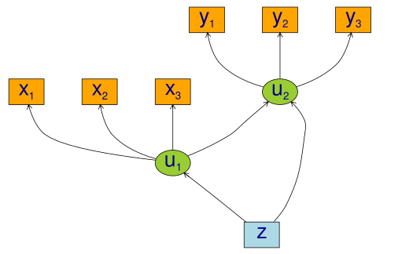
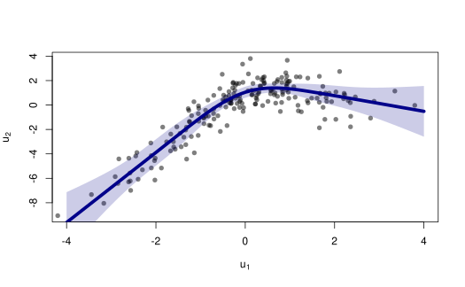
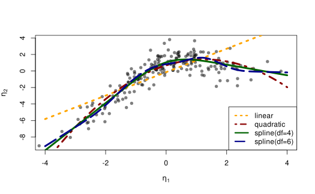
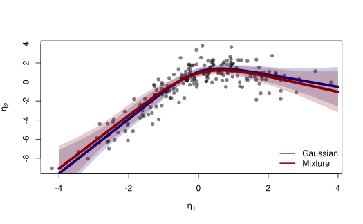

# Non-linear latent variable models and error-in-variable models

``` r
library("lava")
```

We consider the measurement models given by

X\_{j} = u\_{1} + \epsilon\_{j}^{x}, \quad j=1,2,3 Y\_{j} = u\_{2} +
\epsilon\_{j}^{y}, \quad j=1,2,3 and with a structural model given by
u\_{2} = f(u\_{1}) + Z + \zeta\_{2} u\_{1} = Z + \zeta\_{1} with iid
measurement errors
\epsilon\_{j}^{x},\epsilon\_{j}^{y},\zeta\_{1},\zeta\_{2}\sim\mathcal{N}(0,1),
j=1,2,3. and standard normal distributed covariate Z. To simulate from
this model we use the following syntax:

``` r
f <- function(x) cos(1.25*x) + x - 0.25*x^2
m <- lvm(x1+x2+x3 ~ u1, y1+y2+y3 ~ u2, latent=~u1+u2)
regression(m) <- u1+u2 ~ z
functional(m, u2~u1) <- f

d <- sim(m, n=200, seed=42) # Default is all parameters are 1
```

``` r
## plot(m, plot.engine="visNetwork")
plot(m)
```



We refer to (K. K. Holst and Budtz-Jørgensen 2013) for details on the
syntax for model specification.

## Estimation

To estimate the parameters using the two-stage estimator described in
(Klaus Kähler Holst and Budtz-Jørgensen 2020), the first step is now to
specify the measurement models

``` r
m1 <- lvm(x1+x2+x3 ~ u1, u1 ~ z, latent=~u1)
m2 <- lvm(y1+y2+y3 ~ u2, u2 ~ z, latent=~u2)
```

Next, we specify a quadratic relationship between the two latent
variables

``` r
nonlinear(m2, type="quadratic") <- u2 ~ u1
```

and the model can then be estimated using the two-stage estimator

``` r
e1 <- twostage(m1, m2, data=d)
e1
#>                     Estimate Std. Error  Z-value   P-value
#> Measurements:                                             
#>    y2~u2             0.97686    0.03451 28.30873    <1e-12
#>    y3~u2             1.04485    0.03485 29.98162    <1e-12
#> Regressions:                                              
#>    u2~z              0.88513    0.20778  4.25996 2.045e-05
#>    u2~u1_1           1.14072    0.17410  6.55194 5.679e-11
#>    u2~u1_2          -0.45055    0.07161 -6.29195 3.135e-10
#> Intercepts:                                               
#>    y2               -0.12198    0.10915 -1.11749    0.2638
#>    y3               -0.09879    0.10545 -0.93680    0.3489
#>    u2                0.67814    0.17363  3.90567 9.396e-05
#> Residual Variances:                                       
#>    y1                1.30730    0.17743  7.36790          
#>    y2                1.11056    0.14478  7.67064          
#>    y3                0.80961    0.13203  6.13219          
#>    u2                2.08483    0.28986  7.19258
```

We see a clear statistically significant effect of the second order term
(`u2~u1_2`). For comparison we can also estimate the full MLE of the
linear model:

``` r
e0 <- estimate(regression(m1%++%m2, u2~u1), d)
estimate(e0,keep="^u2~[a-z]",regex=TRUE) ## Extract coef. matching reg.ex.
#>       Estimate Std.Err    2.5% 97.5%   P-value
#> u2~u1   1.4140  0.2261 0.97083 1.857 4.014e-10
#> u2~z    0.6374  0.2778 0.09291 1.182 2.177e-02
```

Next, we calculate predictions from the quadratic model using the
estimated parameter coefficients
\mathbb{E}\_{\widehat{\theta}\_{2}}(u\_{2} \mid u\_{1}, Z=0),

``` r
newd <- expand.grid(u1=seq(-4, 4, by=0.1), z=0)
pred1 <- predict(e1, newdata=newd, x=TRUE)
head(pred1)
#>              y1         y2         y3         u2
#> [1,] -11.093569 -10.958869 -11.689950 -11.093569
#> [2,] -10.623561 -10.499736 -11.198861 -10.623561
#> [3,] -10.162565 -10.049406 -10.717187 -10.162565
#> [4,]  -9.710579  -9.607878 -10.244928  -9.710579
#> [5,]  -9.267605  -9.175153  -9.782084  -9.267605
#> [6,]  -8.833641  -8.751230  -9.328656  -8.833641
```

To obtain a potential better fit we next proceed with a natural cubic
spline

``` r
kn <- seq(-3,3,length.out=5)
nonlinear(m2, type="spline", knots=kn) <- u2 ~ u1
e2 <- twostage(m1, m2, data=d)
e2
#>                     Estimate Std. Error  Z-value   P-value
#> Measurements:                                             
#>    y2~u2             0.97752    0.03453 28.31279    <1e-12
#>    y3~u2             1.04508    0.03487 29.97132    <1e-12
#> Regressions:                                              
#>    u2~z              0.86729    0.20272  4.27816 1.884e-05
#>    u2~u1_1           2.86231    0.67275  4.25464 2.094e-05
#>    u2~u1_2           0.00344    0.10097  0.03409    0.9728
#>    u2~u1_3          -0.26270    0.29398 -0.89362    0.3715
#>    u2~u1_4           0.50778    0.35189  1.44301     0.149
#> Intercepts:                                               
#>    y2               -0.12185    0.10922 -1.11563    0.2646
#>    y3               -0.09874    0.10545 -0.93638    0.3491
#>    u2                1.83814    1.66430  1.10445    0.2694
#> Residual Variances:                                       
#>    y1                1.31286    0.17750  7.39636          
#>    y2                1.10412    0.14455  7.63858          
#>    y3                0.81124    0.13184  6.15312          
#>    u2                1.99404    0.26939  7.40217
```

Confidence limits can be obtained via the Delta method using the
`estimate` method:

``` r
p <- cbind(u1=newd$u1,
      estimate(e2,f=function(p) predict(e2,p=p,newdata=newd))$coefmat)
head(p)
#>      u1  Estimate   Std.Err      2.5%     97.5%      P-value
#> p1 -4.0 -9.611119 1.2647438 -12.08997 -7.132266 2.978258e-14
#> p2 -3.9 -9.324887 1.2051236 -11.68689 -6.962888 1.012298e-14
#> p3 -3.8 -9.038656 1.1463511 -11.28546 -6.791849 3.152449e-15
#> p4 -3.7 -8.752425 1.0885636 -10.88597 -6.618879 8.958735e-16
#> p5 -3.6 -8.466193 1.0319265 -10.48873 -6.443654 2.320163e-16
#> p6 -3.5 -8.179962 0.9766402 -10.09414 -6.265782 5.493627e-17
```

The fitted function can be obtained with the following code:

``` r
plot(I(u2-z) ~ u1, data=d, col=Col("black",0.5), pch=16,
     xlab=expression(u[1]), ylab=expression(u[2]), xlim=c(-4,4))
lines(Estimate ~ u1, data=as.data.frame(p), col="darkblue", lwd=5)
confband(p[,1], lower=p[,4], upper=p[,5], polygon=TRUE,
     border=NA, col=Col("darkblue",0.2))
```



## Cross-validation

A more formal comparison of the different models can be obtained by
cross-validation. Here we specify linear, quadratic and cubic spline
models with 4 and 9 degrees of freedom.

``` r
m2a <- nonlinear(m2, type="linear", u2~u1)
m2b <- nonlinear(m2, type="quadratic", u2~u1)
kn1 <- seq(-3,3,length.out=5)
kn2 <- seq(-3,3,length.out=8)
m2c <- nonlinear(m2, type="spline", knots=kn1, u2~u1)
m2d <- nonlinear(m2, type="spline", knots=kn2, u2~u1)
```

To assess the model fit average RMSE is estimated with 5-fold
cross-validation repeated two times

``` r
## Scale models in stage 2 to allow for a fair RMSE comparison
d0 <- d
for (i in endogenous(m2))
    d0[,i] <- scale(d0[,i],center=TRUE,scale=TRUE)
## Repeated 5-fold cross-validation:
ff <- lapply(list(linear=m2a,quadratic=m2b,spline4=m2c,spline6=m2d),
        function(m) function(data,...) twostage(m1,m,data=data,stderr=FALSE,control=list(start=coef(e0),contrain=TRUE)))
fit.cv <- lava:::cv(ff,data=d,K=5,rep=2,mc.cores=parallel::detectCores(),seed=1)
```

``` r
fit.cv$coef
#>               RMSE
#> linear    2.137633
#> quadratic 1.806409
#> spline4   1.747002
#> spline6   1.760896
```

Here the RMSE is in favour of the splines model with 4 degrees of
freedom:

``` r
fit <- lapply(list(m2a,m2b,m2c,m2d),
         function(x) {
         e <- twostage(m1,x,data=d)
         pr <- cbind(u1=newd$u1,predict(e,newdata=newd$u1,x=TRUE))
         return(list(estimate=e,predict=as.data.frame(pr)))
         })

plot(I(u2-z) ~ u1, data=d, col=Col("black",0.5), pch=16,
     xlab=expression(eta[1]), ylab=expression(eta[2]), xlim=c(-4,4))
col <- c("orange","darkred","darkgreen","darkblue")
lty <- c(3,4,1,5)
for (i in seq_along(fit)) {
    with(fit[[i]]$pr, lines(u2 ~ u1, col=col[i], lwd=4, lty=lty[i]))
}
legend("bottomright",
      c("linear","quadratic","spline(df=4)","spline(df=6)"),
      col=col, lty=lty, lwd=3)
```



For convenience, the function `twostageCV` can be used to do the
cross-validation (also for choosing the mixture distribution via the
`nmix` argument, see the section below). For example,

``` r
set.seed(1)
selmod <- twostageCV(m1, m2, data=d, df=2:4, nmix=1:2,
        nfolds=5, rep=2, mc.cores=parallel::detectCores())
```

applies cross-validation (here just 2 folds for simplicity) to select
the best splines with degrees of freedom varying from 1-3 (the linear
model is automatically included)

``` r
selmod
#> ────────────────────────────────────────────────────────────────────────────────
#> Selected mixture model: 2 components
#>       AIC1
#> 1 1961.839
#> 2 1958.803
#> ────────────────────────────────────────────────────────────────────────────────
#> Selected spline model degrees of freedom: 4
#> Knots: -3.958 -1.968 0.02149 2.011 4.001 
#> 
#>      RMSE(nfolds=, rep=)
#> df:1            2.135108
#> df:2            1.883176
#> df:3            1.918421
#> df:4            1.860711
#> ────────────────────────────────────────────────────────────────────────────────
#> 
#>                     Estimate Std. Error Z-value  P-value   std.xy  
#> Measurements:                                                      
#>    y1~u2             1.00000                                0.93509
#>    y2~u2             0.97827  0.03464   28.24164   <1e-12   0.94291
#>    y3~u2             1.04529  0.03482   30.01849   <1e-12   0.96175
#> Regressions:                                                       
#>    u2~z              1.02726  0.22350    4.59630 4.301e-06  0.34700
#>    u2~u1_1           2.61264  0.90770    2.87830 0.003998   1.13566
#>    u2~u1_2           0.01368  0.06464    0.21164 0.8324     0.30984
#>    u2~u1_3          -0.19029  0.17477   -1.08879 0.2762    -1.48961
#>    u2~u1_4           0.35252  0.19173    1.83859 0.06597    0.52314
#> Intercepts:                                                        
#>    y1                0.00000                                0.00000
#>    y2               -0.12170  0.10925   -1.11391 0.2653    -0.03871
#>    y3               -0.09870  0.10546   -0.93592 0.3493    -0.02997
#>    u2                1.54968  2.64293    0.58635 0.5576     0.51143
#> Residual Variances:                                                
#>    y1                1.31889  0.17659    7.46873            0.12560
#>    y2                1.09634  0.14483    7.56960            0.11093
#>    y3                0.81386  0.13260    6.13772            0.07504
#>    u2                1.99291  0.28189    7.06988            0.21706
```

## Specification of general functional forms

Next, we show how to specify a general functional relation of multiple
different latent or exogenous variables. This is achieved via the
`predict.fun` argument. To illustrate this we include interactions
between the latent variable u\_{1} and a dichotomized version of the
covariate z

``` r
d$g <- (d$z<0)*1 ## Group variable
mm1 <- regression(m1, ~g)  # Add grouping variable as exogenous variable (effect specified via 'predict.fun')
mm2 <- regression(m2, u2~ u1+u2+u1:g+u2:g+z)
pred <- function(mu,var,data,...) {
    cbind("u1"=mu[,1],"u2"=mu[,1]^2+var[1],
      "u1:g"=mu[,1]*data[,"g"],"u2:g"=(mu[,1]^2+var[1])*data[,"g"])
}
ee1 <- twostage(mm1, model2=mm2, data=d, predict.fun=pred)
estimate(ee1,keep="u2~u",regex=TRUE)
#>         Estimate Std.Err     2.5%    97.5%   P-value
#> u2~u2     0.4553 0.04660  0.36393  0.54660 1.523e-22
#> u2~u1     0.2294 0.12241 -0.01047  0.46936 6.087e-02
#> u2~u1:g   0.5874 0.25055  0.09637  1.07852 1.905e-02
#> u2~u2:g  -0.1956 0.08673 -0.36556 -0.02559 2.413e-02
```

A formal test show no statistically significant effect of this
interaction

``` r
summary(estimate(ee1,keep="(:g)", regex=TRUE))
#> Call: estimate.default(contrast = as.list(seq_along(p)), vcov = vcov(object, 
#>     messages = 0), coef = p)
#> ────────────────────────────────────────────────────────────
#>           Estimate Std.Err     2.5%    97.5% P-value
#> [u2~u1:g]   0.5874 0.25055  0.09637  1.07852 0.01905
#> [u2~u2:g]  -0.1956 0.08673 -0.36556 -0.02559 0.02413
#> ────────────────────────────────────────────────────────────
#> Null Hypothesis: 
#>   [u2~u1:g] = 0
#>   [u2~u2:g] = 0 
#>  
#> chisq = 27.4922, df = 2, p-value = 1.072e-06
```

## Mixture models

Lastly, we demonstrate how the distributional assumptions of stage 1
model can be relaxed by letting the conditional distribution of the
latent variable given covariates follow a Gaussian mixture distribution.
The following code explictly defines the parameter constraints of the
model by setting the intercept of the first indicator variable, x\_{1},
to zero and the factor loading parameter of the same variable to one.

``` r
m1 <- baptize(m1)  ## Label all parameters
intercept(m1, ~x1+u1) <- list(0,NA) ## Set intercept of x1 to zero. Remove the label of u1
regression(m1,x1~u1) <- 1 ## Factor loading fixed to 1
```

The mixture model may then be estimated using the `mixture` method
(note, this requires the `mets` package to be installed), where the
Parameter names shared across the different mixture components given in
the `list` will be constrained to be identical in the mixture model.
Thus, only the intercept of u\_{1} is allowed to vary between the
mixtures.

``` r
set.seed(1)
em0 <- mixture(m1, k=2, data=d)
```

To decrease the risk of using a local maximizer of the likelihood we can
rerun the estimation with different random starting values

``` r
em0 <- NULL
ll <- c()
for (i in 1:5) {
    set.seed(i)
    em <- mixture(m1, k=2, data=d, control=list(trace=0))
    ll <- c(ll,logLik(em))
    if (is.null(em0) || logLik(em0)<tail(ll,1))
    em0 <- em
}
```

``` r
summary(em0)
#> Cluster 1 (n=162, Prior=0.776):
#> --------------------------------------------------
#>                     Estimate Std. Error Z value  Pr(>|z|)
#> Measurements:                                            
#>    x1~u1             1.00000                             
#>    x2~u1             0.99581  0.07940   12.54098   <1e-12
#>    x3~u1             1.06345  0.08436   12.60541   <1e-12
#> Regressions:                                             
#>    u1~z              1.06674  0.08527   12.50988   <1e-12
#> Intercepts:                                              
#>    x1                0.00000                             
#>    x2                0.03845  0.09890    0.38882 0.6974  
#>    x3               -0.02549  0.10333   -0.24668 0.8052  
#>    u1                0.20926  0.13162    1.58988 0.1119  
#> Residual Variances:                                      
#>    x1                0.98540  0.13316    7.40026         
#>    x2                0.97181  0.13156    7.38695         
#>    x3                1.01316  0.14294    7.08815         
#>    u1                0.29046  0.11128    2.61004         
#> 
#> Cluster 2 (n=38, Prior=0.224):
#> --------------------------------------------------
#>                     Estimate Std. Error Z value  Pr(>|z|) 
#> Measurements:                                             
#>    x1~u1             1.00000                              
#>    x2~u1             0.99581  0.07940   12.54098   <1e-12 
#>    x3~u1             1.06345  0.08436   12.60541   <1e-12 
#> Regressions:                                              
#>    u1~z              1.06674  0.08527   12.50988   <1e-12 
#> Intercepts:                                               
#>    x1                0.00000                              
#>    x2                0.03845  0.09890    0.38882 0.6974   
#>    x3               -0.02549  0.10333   -0.24668 0.8052   
#>    u1               -1.44289  0.25867   -5.57813 2.431e-08
#> Residual Variances:                                       
#>    x1                0.98540  0.13316    7.40026          
#>    x2                0.97181  0.13156    7.38695          
#>    x3                1.01316  0.14294    7.08815          
#>    u1                0.29046  0.11128    2.61004          
#> --------------------------------------------------
#> AIC= 1958.803 
#> ||score||^2= 7.906111e-06
```

Measured by AIC there is a slight improvement in the model fit using the
mixture model

``` r
e0 <- estimate(m1,data=d)
AIC(e0,em0)
#>     df      AIC
#> e0  10 1961.839
#> em0 12 1958.803
```

The spline model may then be estimated as before with the `two-stage`
method

``` r
em2 <- twostage(em0,m2,data=d)
em2
#>                     Estimate Std. Error  Z-value   P-value
#> Measurements:                                             
#>    y2~u2             0.97823    0.03464 28.23707    <1e-12
#>    y3~u2             1.04530    0.03480 30.04033    <1e-12
#> Regressions:                                              
#>    u2~z              1.02884    0.22333  4.60677  4.09e-06
#>    u2~u1_1           2.80414    0.65543  4.27832 1.883e-05
#>    u2~u1_2          -0.02249    0.09997 -0.22498     0.822
#>    u2~u1_3          -0.17332    0.28932 -0.59908    0.5491
#>    u2~u1_4           0.38672    0.33978  1.13815    0.2551
#> Intercepts:                                               
#>    y2               -0.12171    0.10925 -1.11401    0.2653
#>    y3               -0.09870    0.10546 -0.93588    0.3493
#>    u2                2.12374    1.66609  1.27468    0.2024
#> Residual Variances:                                       
#>    y1                1.31872    0.17654  7.46974          
#>    y2                1.09690    0.14502  7.56379          
#>    y3                0.81345    0.13259  6.13512          
#>    u2                1.99590    0.28290  7.05501
```

In this example the results are very similar to the Gaussian model:

``` r
plot(I(u2-z) ~ u1, data=d, col=Col("black",0.5), pch=16,
     xlab=expression(eta[1]), ylab=expression(eta[2]))

lines(Estimate ~ u1, data=as.data.frame(p), col="darkblue", lwd=5)
confband(p[,1], lower=p[,4], upper=p[,5], polygon=TRUE,
     border=NA, col=Col("darkblue",0.2))

pm <- cbind(u1=newd$u1,
        estimate(em2, f=function(p) predict(e2,p=p,newdata=newd))$coefmat)
lines(Estimate ~ u1, data=as.data.frame(pm), col="darkred", lwd=5)
confband(pm[,1], lower=pm[,4], upper=pm[,5], polygon=TRUE,
     border=NA, col=Col("darkred",0.2))
legend("bottomright", c("Gaussian","Mixture"),
       col=c("darkblue","darkred"), lwd=2, bty="n")
```



## SessionInfo

``` r
sessionInfo()
#> R version 4.5.3 (2026-03-11)
#> Platform: x86_64-pc-linux-gnu
#> Running under: Ubuntu 24.04.4 LTS
#> 
#> Matrix products: default
#> BLAS:   /usr/lib/x86_64-linux-gnu/openblas-pthread/libblas.so.3 
#> LAPACK: /usr/lib/x86_64-linux-gnu/openblas-pthread/libopenblasp-r0.3.26.so;  LAPACK version 3.12.0
#> 
#> locale:
#>  [1] LC_CTYPE=C.UTF-8       LC_NUMERIC=C           LC_TIME=C.UTF-8       
#>  [4] LC_COLLATE=C.UTF-8     LC_MONETARY=C.UTF-8    LC_MESSAGES=C.UTF-8   
#>  [7] LC_PAPER=C.UTF-8       LC_NAME=C              LC_ADDRESS=C          
#> [10] LC_TELEPHONE=C         LC_MEASUREMENT=C.UTF-8 LC_IDENTIFICATION=C   
#> 
#> time zone: UTC
#> tzcode source: system (glibc)
#> 
#> attached base packages:
#> [1] stats     graphics  grDevices utils     datasets  methods   base     
#> 
#> other attached packages:
#> [1] lava_1.9.0
#> 
#> loaded via a namespace (and not attached):
#>  [1] Matrix_1.7-4           future.apply_1.20.2    jsonlite_2.0.0        
#>  [4] compiler_4.5.3         Rcpp_1.1.1             parallel_4.5.3        
#>  [7] Rgraphviz_2.54.0       jquerylib_0.1.4        globals_0.19.1        
#> [10] splines_4.5.3          systemfonts_1.3.2      textshaping_1.0.5     
#> [13] yaml_2.3.12            fastmap_1.2.0          lattice_0.22-9        
#> [16] R6_2.6.1               generics_0.1.4         knitr_1.51            
#> [19] BiocGenerics_0.56.0    htmlwidgets_1.6.4      graph_1.88.1          
#> [22] future_1.70.0          desc_1.4.3             bslib_0.10.0          
#> [25] rlang_1.1.7            cachem_1.1.0           xfun_0.57             
#> [28] fs_2.0.1               sass_0.4.10            cli_3.6.5             
#> [31] pkgdown_2.2.0          digest_0.6.39          grid_4.5.3            
#> [34] mvtnorm_1.3-6          lifecycle_1.0.5        timereg_2.0.7         
#> [37] RcppArmadillo_15.2.4-1 evaluate_1.0.5         numDeriv_2016.8-1.1   
#> [40] listenv_0.10.1         codetools_0.2-20       ragg_1.5.2            
#> [43] survival_3.8-6         stats4_4.5.3           parallelly_1.46.1     
#> [46] rmarkdown_2.31         mets_1.3.9             tools_4.5.3           
#> [49] htmltools_0.5.9
```

## Bibliography

Holst, K. K., and E. Budtz-Jørgensen. 2013. “Linear Latent Variable
Models: The Lava-Package.” *Computational Statistics* 28 (4): 1385–1452.
<https://doi.org/10.1007/s00180-012-0344-y>.

Holst, Klaus Kähler, and Esben Budtz-Jørgensen. 2020. “A Two-Stage
Estimation Procedure for Non-Linear Structural Equation Models.”
*Biostatistics* (in press).
<https://doi.org/10.1093/biostatistics/kxy082>.
