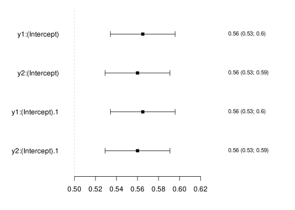
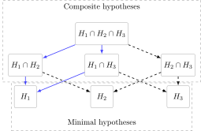

# The Art of Influence

## Influence functions

Estimators that have parametric convergence rates can often be fully
characterized by their *influence function* (IF), also referred to as an
influence curve ([Bickel et al.
1998](#ref-bickel_effic_adapt_estim_semip_model); [Vaart
1998](#ref-vaart_1998_asymp)). The IF allows for the direct estimation
of properties of the estimator, including its asymptotic variance.
Moreover, estimates of the IF enable the simple combination and
transformation of estimators into new ones. This vignette describes how
to estimate and manipulate IFs using the R-package `lava` ([Holst and
Budtz-Jørgensen 2013](#ref-holst_budtzjorgensen_2013)).

Formally, let Z_1,\ldots,Z_n be iid k-dimensional stochastic variables,
Z_i=(Y\_{i},A\_{i},W\_{i})\sim P\_{0}, and \widehat{\theta} a consistent
estimator for the parameter \theta\in\mathbb{R}^p. When \widehat{\theta}
is a *regular and asymptotic linear* (RAL) estimator, it has a unique
iid decomposition \begin{align\*} \sqrt{n}(\widehat{\theta}-\theta) =
\frac{1}{\sqrt{n}}\sum\_{i=1}^n \operatorname{IC}(Z_i; P\_{0}) +
o\_{P}(1), \end{align\*} where the function \operatorname{IC} is the
unique *Influence Function* s.t. \mathbb{E}\\\operatorname{IC}(Z\_{i};
P\_{0})\\=0 and \mathbb{V}\\\text{ar}\\\operatorname{IC}(Z\_{i};
P\_{0})\\\<\infty ([Tsiatis 2006](#ref-tsiatis2006semiparametric);
[Vaart 1998](#ref-vaart_1998_asymp)). The influence function thus fully
characterizes the asymptotic behaviour of the estimator and by the
central limit theorem it follows that the estimator converges weakly to
a Gaussian distribution \sqrt{n}(\widehat{\theta}-\theta)
\overset{\mathcal{D}}{\longrightarrow} \mathcal{N}(0,
\mathbb{V}\\\text{ar}\\\operatorname{IC}(Z; P\_{0})\\), where the
empirical variance of the plugin estimator,
\mathbb{P}\_{n}\operatorname{IC}(Z; \widehat{P})^{\otimes 2} =
\frac{1}{n}\sum\_{i=1}^n \operatorname{IC}(Z\_{i};
\widehat{P})\operatorname{IC}(Z\_{i}; \widehat{P})^{\top} can be used to
obtain a consistent estimate of the asymptotic variance. Note, in
practice the estimate \widehat{P} used in the plugin-estimate, needs
only to capture the parts of the distribution of Z that is necessary to
evaluate the IF. In some cases this nuisance parameter can be estimated
using flexible machine learning components and in other (parametric)
cases be derived directly from \widehat{\theta}.

The IFs are easily derived for the parameters of many parametric
statistical models as illustrated in the [next example
sections](#example-generalized-linear-model). More generally, the IF can
also be derived for a smooth target parameter \Psi:
\mathcal{P}\to\mathbb{R} where \mathcal{P} is a family of probability
distributions forming the statistical model, which often can be left
completely non-parametric. Formally, the parameter must be *pathwise
differentiable* see ([Vaart 1998](#ref-vaart_1998_asymp)) in the sense
that there exists a bounded linear functional \dot\Psi\colon
L\_{2}(P\_{0})\to\mathbb{R} such that \[\Psi(P\_{t}) -
\Psi(P\_{0})\]t^{-1} \to \dot\Psi(P\_{0})(g) as t\to 0 for any
parametric submodel P_t with score model g(z)= \partial/(\partial t)
\log (p_t)(z)\|\_{t=0}. Riesz’s representation theorem then tells us
that the directional derivative has a unique representer, \phi\_{P\_{0}}
lying in the closure of the submodel score space (the *tangent space*),
s.t. \begin{align\*} \dot\Psi(P_0)(g) = \langle\phi\_{P_0}, g\rangle =
\int \phi\_{P_0}(z)g(z)\\dP_0(z) \end{align\*} The unique representer is
exactly the IF which can be found by solving the above integral
equation. For more details on how to derive influence functions, we
refer to ([Laan and Rose 2011](#ref-targetedlearning_2011); [Hines et
al. 2022](#ref-hines2022)).

As an example we might be interested in the target parameter \Psi(P) =
\mathbb{E}\_P(Z) which can be shown to have the unique (and thereby
efficient) influence function Z\mapsto Z-\mathbb{E}\_P(Z) under the
non-parametric model. Another target parameter could be \Psi\_{a}(P) =
\mathbb{E}\_{P}\[\mathbb{E}\_{P}(Y\mid A=a, W)\] which is often a key
interest in causal inference and which has the IF \begin{align\*}
\operatorname{IC}(Y,A,W; P) = \frac{\mathbf{1}(A=a)}{\mathbb{P}(A=a\mid
W)}(Y-\mathbb{E}\_{P}\[Y\mid A=a,W\]) + \mathbb{E}\_{P}\[Y\mid A=a,W\] -
\Psi\_{a}(P) \end{align\*} See section on [average treatment
effects](#average-treatment-effects).

## Working with influence functions with `lava::estimate`

The main functions for working with influence functions are

- `estimate` which prepares a model object and estimates the IF and
  corresponding robust standard errors. Can also be used to transform
  model parameters by application of the Delta Theorem.
- `merge` method for combining estimates via their estimated IFs
- `IC`, `coef`, `vcov` methods to extract the estimated IF,
  coefficients, and asymptotic covariance matrix
- `subset` for extracting subset of parameters and IFs
- `transform` method for transforming parameter estimates
- `labels` for renaming parameters

The `estimate` function is the primary tool for obtaining parameter
estimates and related information. It returns an object of the class
type `estimate`, which is a general container for holding information
about estimated parameters. The estimate function takes as input either
a model object (the first argument `x`), or a parameter vector and
corresponding influence function (IF) matrix specified using the `coef`
and `IC` arguments. If the primary goal is to apply the delta method or
test linear hypotheses, it is also possible to provide the asymptotic
variance estimate via the `vcov` argument, without specifying the IC
matrix.

``` r

estimate(x=, ...)
estimate(coef=, IC=, ...)
estimate(coef=, vcov=, ...)
```

A typical call could look like

``` r

merge(subset(estimate(x), 1), estimate(coef=p, IC=ic, id=id)) |>
  transform(function(x) c(exp(x), exp(x[1]))) |> # parameter transformation
  labels(c("a", "b")) # rename parameters
```

Direct calculations are also possible, if `a` and `b` are estimate
objects we can obtain new transformed parameter estimates with the
syntax

``` r

c(exp(b)^0.5, exp(b * a) / (1 + exp(-b)))
```

with the necessary derivatives exactly calculated automatically. We
refer to section [IF building
blocks](#if-building-blocks-transformations-and-the-delta-theorem) for
more details.

## Examples

To illustrate the methods we consider data arising from the model
Y\_{ij} \sim Bernoulli\\\operatorname{expit}(X\_{ij} + A\_{i} +
W\_{i})\\, A\_{i} \sim Bernoulli\\\operatorname{expit}(W\_{i})\\ with
independent covariates X\_{ij}\sim\mathcal{N}(0,1),
W\_{i}\sim\mathcal{N}(0,1).

``` r

m <- lvm() |>
  regression(y1 ~ x1 + a + w) |>
  regression(y2 ~ x2 + a + w) |>
  regression(y3 ~ x3 + a + w) |>
  regression(y4 ~ x4 + a + w) |>
  regression(a ~ w) |>
  distribution(~ y1 + y2 + y3 + y4 + a, value = dist_bernoulli()) |>
  distribution(~id, value = dist_seq(integer = TRUE))
```

We simulate from the model where Y_3 is only observed for half of the
subjects

``` r

n <- 1e3
dw <- sim(m, n, seed = 1) |>
  transform(y3 = y3 * ifelse(id > n / 2, NA, 1))
Print(dw)
#>      y1 x1      a w         y2 x2       y3 x3      y4 x4        id  
#> 1    1  -0.6265 1  1.1350   1  -0.88615 1   0.7391 0  -1.1346   1   
#> 2    1   0.1836 1  1.1119   1  -1.92225 1   0.3866 1   0.7646   2   
#> 3    1  -0.8356 1 -0.8708   1   1.61970 1   1.2964 1   0.5707   3   
#> 4    1   1.5953 1  0.2107   1   0.51927 0  -0.8036 0  -1.3517   4   
#> 5    0   0.3295 1  0.0694   0  -0.05585 0  -1.6026 0  -2.0299   5   
#> ---                                                                 
#> 996  0  -0.3133 0 -0.008056 0  -0.1868  NA -0.1422 0   0.162547  996
#> 997  1  -0.8807 1  1.033784 1  -0.2294  NA  0.8643 1   0.980737  997
#> 998  1  -0.4193 1 -0.799127 1   1.6302  NA -0.0219 0  -0.692140  998
#> 999  0  -1.4828 1  1.004233 1  -2.1647  NA -0.2647 1  -0.003494  999
#> 1000 1  -0.6973 0 -0.311973 0  -1.0778  NA -0.9133 1   0.171580 1000
## Data in long format
dl <- reshape(dw,
        varying = list(paste0("y",1:4),
                       paste0("x",1:4)),
        v.names=c("y", "x"), direction="long") |>
  na.omit()
dl <- dl[order(dl$id), ]
## dl <- mets::fast.reshape(dw, varying = c("y", "x")) |> na.omit()
Print(dl)
#>        a w      id   time y x        
#> 1.1    1 1.135  1    1    1 -0.6265  
#> 1.2    1 1.135  1    2    1 -0.8861  
#> 1.3    1 1.135  1    3    1  0.7391  
#> 1.4    1 1.135  1    4    0 -1.1346  
#> 2.1    1 1.112  2    1    1  0.1836  
#> ---                                  
#> 999.2  1  1.004  999 2    1 -2.164671
#> 999.4  1  1.004  999 4    1 -0.003494
#> 1000.1 0 -0.312 1000 1    1 -0.697318
#> 1000.2 0 -0.312 1000 2    0 -1.077776
#> 1000.4 0 -0.312 1000 4    1  0.171580
```

### Example: population mean

Here we first consider the problem of estimating the IF of the mean. For
a general transformation f: \mathbb{R}^k\to\mathbb{R}^p we have that
\sqrt{n}\\\mathbb{P}\_{n}f(X) - \mathbb{E}\[f(X)\]\\ =
\frac{1}{\sqrt{n}}\sum\_{i=1}^{n} \\f(X\_{i}) - \mathbb{E}\[f(X)\]\\ and
hence for the problem of estimating the proportion of the binary outcome
Y_1, the IF is given by \mathbf{1}(Y\_{1}=1) - \mathbb{P}(Y\_{1}=1).

To estimate this parameter and its IF we will use the `estimate`
function

``` r

inp <- as.matrix(dw[, c("y1", "y2")])
e <- estimate(inp[, 1, drop = FALSE], type="mean")
class(e)
#> [1] "estimate"
e
#>    Estimate Std.Err   2.5%  97.5%    P-value
#> y1    0.565 0.01568 0.5343 0.5957 2.009e-284
```

The reported standard errors from the `estimate` method are the robust
standard errors obtained from the IF. The variance estimate and the
parameters can be extracted with the `vcov` and `coef` methods. The IF
itself can be extracted with the `IC` (or `influence`) method:

``` r

IC(e) |> Print()
#>      y1    
#> 1     0.435
#> 2     0.435
#> 3     0.435
#> 4     0.435
#> 5    -0.565
#> ---        
#> 996  -0.565
#> 997   0.435
#> 998   0.435
#> 999  -0.565
#> 1000  0.435
```

It is also possible to simultaneously estimate the proportions of each
of the two binary outcomes

``` r

estimate(inp)
#>    Estimate Std.Err   2.5%  97.5%    P-value
#> y1    0.565 0.01568 0.5343 0.5957 2.009e-284
#> y2    0.560 0.01570 0.5292 0.5908 9.550e-279
```

or alternatively the input can be a model object, here a `mlm` object:

``` r

e <- lm(cbind(y1, y2) ~ 1, data = dw) |>
  estimate()
IC(e) |> head()
#>   y1:(Intercept) y2:(Intercept)
#> 1          0.435           0.44
#> 2          0.435           0.44
#> 3          0.435           0.44
#> 4          0.435           0.44
#> 5         -0.565          -0.56
#> 6         -0.565           0.44
```

Different methods are available for inspecting an `estimate` object

``` r

summary(e)
#> Call: estimate.default(x = x, coef = pars(x))
#> ────────────────────────────────────────────────────────────
#>                Estimate Std.Err   2.5%  97.5%    P-value
#> y1:(Intercept)    0.565 0.01568 0.5343 0.5957 2.009e-284
#> y2:(Intercept)    0.560 0.01570 0.5292 0.5908 9.550e-279
#> ────────────────────────────────────────────────────────────
#> Null Hypothesis: 
#>   [y1:(Intercept)] = 0
#>   [y2:(Intercept)] = 0 
#>  
#> chisq = 2056.775, df = 2, p-value < 2.2e-16
## extract parameter coefficients
coef(e)
#> y1:(Intercept) y2:(Intercept) 
#>          0.565          0.560
## ## Asymptotic (robust) variance estimate
vcov(e)
#>                y1:(Intercept) y2:(Intercept)
#> y1:(Intercept)    0.000245775      0.0000616
#> y2:(Intercept)    0.000061600      0.0002464
## Matrix with estimates and confidence limits
summary(e, level = 0.99) |> parameter()
#>                Estimate    Std.Err      0.5%     99.5%       P-value
#> y1:(Intercept)    0.565 0.01567721 0.5246182 0.6053818 2.009130e-284
#> y2:(Intercept)    0.560 0.01569713 0.5195669 0.6004331 9.550279e-279
## Influence curve
IC(e) |> head()
#>   y1:(Intercept) y2:(Intercept)
#> 1          0.435           0.44
#> 2          0.435           0.44
#> 3          0.435           0.44
#> 4          0.435           0.44
#> 5         -0.565          -0.56
#> 6         -0.565           0.44
## Join estimates
ee <- merge(e, e)
ee
#>                  Estimate Std.Err   2.5%  97.5%    P-value
#> y1:(Intercept)      0.565 0.01568 0.5343 0.5957 2.009e-284
#> y2:(Intercept)      0.560 0.01570 0.5292 0.5908 9.550e-279
#> y1:(Intercept).1    0.565 0.01568 0.5343 0.5957 2.009e-284
#> y2:(Intercept).1    0.560 0.01570 0.5292 0.5908 9.550e-279
## Forest plots
plot(ee, null=0.5, digits=2)
```



### Example: generalized linear model

For a Z-estimator defined by the score equation E\[U(Z; \theta)\] = 0,
the IF is given by \begin{align\*} IC(Z; \theta) =
-\mathbb{E}\Big\\\frac{\partial}{\partial\theta^\top}U(\theta;
Z)\Big\\^{-1}U(Z; \theta) \end{align\*} In particular, for a maximum
likelihood estimator the score, U, is given by the partial derivative of
the log-likelihood function.

As an example, we can obtain the estimates with robust standard errors
for a logistic regression model:

``` r

g <- glm(y1 ~ a + x1, data = dw, family = binomial)
estimate(g)
#>             Estimate Std.Err    2.5%   97.5%   P-value
#> (Intercept)  -0.4033 0.09781 -0.5950 -0.2116 3.742e-05
#> a             1.5832 0.15030  1.2886  1.8778 6.052e-26
#> x1            0.8837 0.08061  0.7257  1.0417 5.835e-28
```

We can compare that to the usual (non-robust) standard errors by
supplying the model-based covariance matrix explicitly:

``` r

estimate(g, vcov = vcov(g))
#>             Estimate Std.Err    2.5%   97.5%   P-value
#> (Intercept)  -0.4033 0.09682 -0.5930 -0.2135 3.111e-05
#> a             1.5832 0.15138  1.2865  1.8799 1.335e-25
#> x1            0.8837 0.08231  0.7223  1.0450 6.904e-27
# estimate(g, vcov = TRUE) alternative syntax to obtain model-based SEs
```

The IF can be extracted from the `estimate` object or directly from the
model object

``` r

IC(g) |> head()
#>   (Intercept)          a         x1
#> 1  0.07717226   4.001259 -0.7195347
#> 2 -0.07604185   2.866943  0.7089951
#> 3  0.14619472   4.257845 -1.3630828
#> 4 -0.09723106   1.252449  0.9065580
#> 5  0.38472247 -11.599820 -3.5870556
#> 6 -2.43751385   2.931614  1.5365778
```

The same estimates can be obtained with a *cumulative link regression*
model which also generalizes to ordinal outcomes. Here we consider the
proportional odds model given by \begin{align\*}
\log\left(\frac{\mathbb{P}(Y\leq j\mid x)}{1-\mathbb{P}(Y\leq j\mid
x)}\right) = \operatorname{expit}(\alpha\_{j} - \beta^{t}), \quad
j=1,\ldots,J-1 \end{align\*}

``` r

ordreg(y1 ~ a + x1, dw, family=binomial(logit)) |> estimate()
#>     Estimate Std.Err   2.5% 97.5%   P-value
#> 0|1   0.4033 0.09781 0.2116 0.595 3.743e-05
#> a     1.5832 0.15031 1.2886 1.878 6.080e-26
#> x1    0.8837 0.08062 0.7257 1.042 5.866e-28
```

Note that the
[`sandwich::estfun`](https://zeileis.codeberg.page/sandwich/reference/estfun.html)
function from the `sandwich` library ([Zeileis et al.
2020](#ref-r_sandwich)) can also be used to estimate the IF for
different parametric models, but does not provide the tools for
combining and transforming these.

### Example: right-censored outcomes

To illustrate the methods on survival data we will use the Mayo Clinic
Primary Biliary Cholangitis Data ([Therneau and Grambsch
2000](#ref-therneau00surv))

``` r

library("survival")
data(pbc, package="survival")
```

The Cox proportional hazards model can be fitted with the
[`mets::phreg`](http://kkholst.github.io/mets/reference/phreg.md) method
which can estimate the IF for both the partial likelihood parameters and
the baseline hazard. Here we fit a survival model with right-censored
event times

``` r

fit.phreg <- mets::phreg(Surv(time, status > 0) ~ age + sex, data = pbc)
fit.phreg
#> Call:
#> mets::phreg(formula = Surv(time, status > 0) ~ age + sex, data = pbc)
#> 
#>    n events
#>  418    186
#> 
#> coefficients:
#>        age       sexf 
#>  0.0220977 -0.2999507
IC(fit.phreg) |> head()
#>           age       sexf
#> 1  0.12691175  2.9551968
#> 2 -0.16011629 -4.3755455
#> 3  0.19322595 -8.1786480
#> 4  0.04668109  0.8548021
#> 5 -0.22936186  0.9721761
#> 6  0.07015171  0.5644414
```

The IF for the baseline cumulative hazard at a specific time point
\begin{align\*} \Lambda_0(t) = \int_0^t \lambda_0(u)\\du, \end{align\*}
where \lambda_0(t) is the baseline hazard, can be estimated in similar
way:

``` r

baseline <- function(object, time, ...) {
  ic <- mets::IC(object, baseline = TRUE, time = time, ...)
  est <- mets::predictCumhaz(object$cumhaz, new.time = time)[1, 2]
  estimate(NULL, coef = est, IC = ic, labels = paste0("chaz:", time))
}
tt <- 2000
baseline(fit.phreg, tt)
#>           Estimate Std.Err    2.5%  97.5% P-value
#> chaz:2000    0.178 0.07597 0.02913 0.3269 0.01911
```

The `estimate` and `IC` methods are also available for parametric
survival models via
[`survival::survreg`](https://rdrr.io/pkg/survival/man/survreg.html),
here a Weibull model:

``` r

survival::survreg(Surv(time, status > 0) ~ age + sex, data = pbc, dist="weibull") |>
  estimate()
#>             Estimate  Std.Err     2.5%     97.5%    P-value
#> (Intercept)  9.02697 0.382437  8.27741  9.776530 3.521e-123
#> age         -0.01919 0.006362 -0.03166 -0.006723  2.554e-03
#> sexf         0.28170 0.174338 -0.06000  0.623392  1.061e-01
#> scale        0.87751 0.070693  0.73896  1.016067  2.220e-35
```

### Example: random effects model / structural equation model

General structural equation models (SEMs) can be estimated with
[`lava::lvm`](https://kkholst.github.io/lava/reference/lvm.md). Here we
fit a random effects probit model \mathbb{P}(Y\_{ij} = 1 \mid U\_{i},
W\_{ij})=\Phi(\mu\_{j} + \beta\_{j} W\_{ij} + U\_{i}), \quad
U\_{i}\sim\mathcal{N}(0,\sigma\_{u}^{2}),\quad j=1,2 to the simulated
dataset

``` r

sem <- lvm(y1 + y2 ~ 1 * u + w) |>
  latent(~ u) |>
  ordinal(K=2, ~ y1 + y2)
semfit <- estimate(sem, data = dw)

## Robust standard errors
estimate(semfit)
#>      Estimate Std.Err     2.5%  97.5%   P-value
#> y2   -0.01236 0.06232 -0.13450 0.1098 8.428e-01
#> u     0.21656 0.04640  0.12562 0.3075 3.052e-06
#> y1~w  0.59037 0.05307  0.48635 0.6944 9.645e-29
#> y2~w  0.65419 0.05599  0.54446 0.7639 1.528e-31
#> u~~u  0.19001 0.07614  0.04078 0.3392 1.257e-02
```

### Example: quantile

Let \beta denote the \tauth quantile of X, with IF \begin{align\*}
\operatorname{IC}(x; P\_{0}) = \\\tau - \mathbf{1}(x\leq
\beta)\\f\_{0}(\beta)^{-1} \end{align\*}

where f\_{0} is the density function of X.

To calculate the variance estimate, an estimate of the density is thus
needed which can be obtained by a kernel estimate. Alternatively, the
resampling method of ([Zeng and Lin 2008](#ref-zenglin2008)) can be
applied. Here we use a kernel smoother (additional arguments to the
`estimate` function are parsed on to
[`stats::density.default`](https://rdrr.io/r/stats/density.html)) to
estimate the quantiles and IF for the 25%, 50%, and 75% quantiles of W
and X_1

``` r

eq <- estimate(dw[, c("w", "x1")], type = "quantile", probs = c(0.25, 0.5, 0.75))
eq
#>        Estimate Std.Err    2.5%    97.5%   P-value
#> w.25%  -0.68967 0.04493 -0.7777 -0.60161 3.465e-53
#> w.50%  -0.03448 0.04091 -0.1147  0.04570 3.993e-01
#> w.75%   0.73734 0.04784  0.6436  0.83111 1.354e-53
#> x1.25% -0.69737 0.04586 -0.7873 -0.60749 3.172e-52
#> x1.50% -0.03532 0.04176 -0.1172  0.04653 3.977e-01
#> x1.75%  0.68843 0.04366  0.6029  0.77400 5.246e-56
IC(eq) |> head()
#>           w.25%     w.50%      w.75%     x1.25%    x1.50%     x1.75%
#> [1,]  0.8202184  1.293737  2.6203624  0.8372545 -1.320712 -0.7971649
#> [2,]  0.8202184  1.293737  2.6203624  0.8372545  1.320712 -0.7971649
#> [3,] -2.4606551 -1.293737 -0.8734541 -2.5117634 -1.320712 -0.7971649
#> [4,]  0.8202184  1.293737 -0.8734541  0.8372545  1.320712  2.3914946
#> [5,]  0.8202184  1.293737 -0.8734541  0.8372545  1.320712 -0.7971649
#> [6,] -2.4606551 -1.293737 -0.8734541 -2.5117634 -1.320712 -0.7971649
```

## Combining influence functions

A key benefit of working with the IFs of estimators is that this allows
for transforming or combining different estimates while easily deriving
the resulting IF and thereby asymptotic distribution of the new
estimator.

**Lemma 1** Let \widehat{\theta}\_{1}, \ldots, \widehat{\theta}\_{M} be
M different estimators with decompositions \begin{align\*}
\sqrt{n}(\widehat{\theta}\_{m}-\theta\_{m}) =
\frac{1}{\sqrt{n}}\sum\_{i=1}^{n} \operatorname{IC}\_m(Z_i; P\_{0}) +
o\_{P}(1) \end{align\*} based on iid data Z_1,\ldots,Z_n. Then the joint
estimate \widehat{\theta} =
(\widehat{\theta}\_{1}^{\top},\ldots,\widehat{\theta}\_{M}^{\top})^\top
of {\theta} = ({\theta}\_{1}^{\top},\ldots,{\theta}\_{M}^{\top})^\top
has influence function given by \begin{align\*}
\overline{\operatorname{IC}}(Z_i; P\_{0}) =
\[\operatorname{IC}\_{1}(Z_i;
P\_{0})^\top,\ldots,\operatorname{IC}\_{M}(Z_i; P\_{0})^\top\]^{\top}.
\end{align\*} \blacksquare

This follows immediately from ([Vaart 1998](#ref-vaart_1998_asymp),
Theorem 18.10\[vi\]), and thus \begin{align\*}
\sqrt{n}(\widehat{\theta}-\theta) &= \frac{1}{\sqrt{n}}\sum\_{i=1}^{n}
\underbrace{\[\operatorname{IC}\_{1}(Z_i;
P\_{0})^\top,\ldots,\operatorname{IC}\_{M}(Z_i;
P\_{0})^\top\]^{\top}}\_{\overline{\operatorname{IC}}(Z_i; P\_{0})} +
o\_{P}(1) \\
&\overset{\mathcal{D}}{\longrightarrow}\mathcal{N}(0,\Sigma)
\end{align\*} by the CLT, and under regularity conditions
\mathbb{P}\_{n}\overline{\operatorname{IC}}(Z_i; \widehat{P})^{\otimes
2} \overset{P}{\longrightarrow}\Sigma as n\to\infty.

To illustrate this we consider two marginal logistic regression models
fitted separately for Y_1 and Y_2 and combine the estimates and IFs
using the `merge` method

``` r

g1 <- glm(y1 ~ a, family=binomial, data=dw)
g2 <- glm(y2 ~ a, family=binomial, data=dw)
e <- merge(g1, g2)
summary(e)
#> Call: estimate.default(data = NULL, id = id, coef = coefs, IC = ic0, 
#>     stack = FALSE, keep = keep)
#> ────────────────────────────────────────────────────────────
#>               Estimate Std.Err    2.5%   97.5%   P-value
#> (Intercept)    -0.3706 0.08887 -0.5448 -0.1964 3.048e-05
#> a               1.4031 0.13692  1.1347  1.6714 1.218e-24
#> (Intercept).1  -0.4342 0.08944 -0.6095 -0.2589 1.207e-06
#> a.1             1.4995 0.13792  1.2291  1.7698 1.562e-27
#> ────────────────────────────────────────────────────────────
#> Null Hypothesis: 
#>   [(Intercept)] = 0
#>   [a] = 0
#>   [(Intercept).1] = 0
#>   [a.1] = 0 
#>  
#> chisq = 214.6624, df = 4, p-value < 2.2e-16
```

As we have access to the joint asymptotic distribution we can for
example test for whether the odds-ratio is the same for the two
responses:

``` r

summary(estimate(e), contrast=cbind(0,1,0,-1), null=0)
#> Call: estimate.default(x = e)
#> ────────────────────────────────────────────────────────────
#>               Estimate Std.Err    2.5%   97.5%   P-value
#> (Intercept)    -0.3706 0.08887 -0.5448 -0.1964 3.048e-05
#> a               1.4031 0.13692  1.1347  1.6714 1.218e-24
#> (Intercept).1  -0.4342 0.08944 -0.6095 -0.2589 1.207e-06
#> a.1             1.4995 0.13792  1.2291  1.7698 1.562e-27
#> ────────────────────────────────────────────────────────────
#> Null Hypothesis: 
#>   [a] - [a.1] = 0 
#>  
#> chisq = 0.2869, df = 1, p-value = 0.5922
```

More details can be found in the Section on [hypothesis
testing](#linear-contrasts-and-hypothesis-testing).

### Estimators computed on different subsets

Let O_1 = (Z_1, R_1), \ldots, O_N = (Z_N, R_N) be iid data from some
distribution O = (Z, R) \sim P_0. We let Q_0 := P_0(\cdot \mid R=1)
denote the conditional distribution, with P(R=1) = p \> 0, and let S =
\\i\mid R_i=1\\, n = \lvert S\rvert, and \widehat{p} = n/N.

We assume that the *conditional* target parameter \theta = T(Q_0) is
pathwise differentiable in Q_0, in the sense that we have a regular and
asymptotic linear estimator \widehat{\theta} = T_m(O_1, \ldots, O_m)
based on iid data O_1,\ldots,O_m \sim Q_0, such that for any \eta\>0
\begin{align\*} g(m, \eta) = Q\Big( \big\lVert \underbrace{
\sqrt{m}\left\\ T_m(O_1, \ldots, O_m) - \theta -
\frac{1}{m}\sum\_{i=1}^m \operatorname{IC}(O_i; Q_0) \right\\ }\_{V_m}
\big\rVert \> \eta \Big) \longrightarrow 0 \text{ as } m\to\infty.
\end{align\*}

**Lemma 2** The estimator \widehat{\theta} has influence function
\widetilde{\operatorname{IC}}(O; Q_0) = \frac{R}{p}\operatorname{IC}(O;
Q_0), i.e. \begin{align\*} \sqrt{N}(\widehat{\theta} - \theta) =
\frac{1}{p}\frac{1}{\sqrt{N}}\sum\_{i=1}^N R_i \operatorname{IC}(O_i;
Q_0) + o\_{P_0}(1). \end{align\*}

*Proof*. We can write \begin{align\*} \sqrt{N}(\widehat{\theta}-\theta)
= \frac{1}{\widehat{p}}\frac{1}{\sqrt{N}} \sum\_{i=1}^N R_i
\operatorname{IC}(O_i; Q_0) + \underbrace{\sqrt{N}\left(
\widehat{\theta}-\theta-\frac{1}{n}\sum\_{i\in S}\operatorname{IC}(O_i;
Q_0) \right)}\_{W_N = \sqrt{N/n}V_n}. \end{align\*}

We need to show that the term W_N=o\_{P_0}(1). Let E_N = \\n \> Np/2\\,
it then follows that \begin{align\*} P(\lVert W_N \rVert \> \epsilon)
\leq P(E_N^\complement) + P(\\\lVert W_N \rVert \> \epsilon\\\cap E_N)
\\ \leq P(E_N^\complement) + \sup\_{n\>Np/2} Q(\lVert V_n \rVert \>
\epsilon/c) \end{align\*} where we have used that on the set E_N we have
\sqrt{N/n}\< \sqrt{2/p} = c. The supremum term converges to zero as
N\to\infty due to the assumption that \widehat{\theta} is RAL in Q_0.

Applying Hoeffding’s Inequality to the iid Bernoulli random variables
1-R_i, i=1,\ldots,N, we get that \begin{align\*} P(N-n - N(1-p) \geq t)
\leq \exp(-2t^2/N), \end{align\*} and with t = Np/2, we have that
P(n\<N\p/2)\leq\exp(-N/(2p^2))\to 0 as N\to\infty, and it follows that
the first term P(E_N^\complement) also converges to zero.

As \widehat{p}\to p a.s. by the strong LLN, it follows from continuity
at p\>0 that \widehat{p}^{-1}-p^{-1} = o\_{P_0}(1), and hence by
Slutsky’s lemma \begin{align\*} \sqrt{N}(\widehat{\theta}-\theta) &=
\frac{1}{\sqrt{N}}\sum\_{i=1}^N \frac{R_i}{p}\operatorname{IC}(O_i;
Q_0) + (\frac{1}{\widehat{p}}-\frac{1}{p})
\frac{1}{\sqrt{N}}\sum\_{i=1}^N R_i\operatorname{IC}(O_i; Q_0) +
o\_{P_0}(1) \\ &= \frac{1}{\sqrt{N}}\sum\_{i=1}^N
\frac{R_i}{p}\operatorname{IC}(O_i; Q_0) + o\_{P_0}(1). \end{align\*}
\blacksquare

Based on the above Lemma we can therefore combine estimators that are
estimated on different datasets. Let the observed data be (Z\_{11},
R\_{11}), (Z\_{21}, R\_{21}), \ldots, (Z\_{1N}, R\_{1N}), (Z\_{2N},
R\_{2N}) with estimators \widehat{\theta}\_1 and \widehat{\theta}\_2 for
the conditional parameters \theta_1 and \theta_2 based on data where
R\_{1i}=1 and R\_{2j}=1, respectively, and let the corresponding IFs be
IC\_{1}(\cdot; P\_{0}) and IC\_{2}(\cdot;P\_{0}). It then follows that
the joint parameter estimate has influence function corresponding to an
inverse probability weighting with the empirical plugin estimate of the
proportions P(R\_{1}=1), and P(R\_{2}=1) \begin{align\*} \sqrt{N}\left\\
\begin{pmatrix} \widehat{\theta}\_1 \\ \widehat{\theta}\_2
\end{pmatrix} - \begin{pmatrix} \vphantom{\widehat{\theta}\_1}\theta_1
\\ \vphantom{\widehat{\theta}\_1}\theta_2 \end{pmatrix} \right\\ =
\frac{1}{\sqrt{N}}\sum\_{i=1}^N \begin{pmatrix} IC_1(Z\_{1i};
P\_{0})\frac{R\_{1i}N}{R\_{1\bullet}} \\ IC_2(Z\_{2i};
P\_{0})\frac{R\_{2i}N}{R\_{2\bullet}} \end{pmatrix} + o\_{P}(1)
\end{align\*}

with R\_{k\bullet} = \sum\_{i=1}^{N}R\_{ki}. Returning to the example,
we can combine the marginal estimates of two model objects that have
been estimated from different datasets (as the outcome Y_3 is only
available in half of the data) with the `merge` function

``` r

g2 <- glm(y2 ~ 1, family = binomial, data = dw)
summary(g2)
#> 
#> Call:
#> glm(formula = y2 ~ 1, family = binomial, data = dw)
#> 
#> Coefficients:
#>             Estimate Std. Error z value Pr(>|z|)    
#> (Intercept)  0.24116    0.06371   3.786 0.000153 ***
#> ---
#> Signif. codes:  0 '***' 0.001 '**' 0.01 '*' 0.05 '.' 0.1 ' ' 1
#> 
#> (Dispersion parameter for binomial family taken to be 1)
#> 
#>     Null deviance: 1371.9  on 999  degrees of freedom
#> Residual deviance: 1371.9  on 999  degrees of freedom
#> AIC: 1373.9
#> 
#> Number of Fisher Scoring iterations: 3
dwc <- na.omit(dw)
g3 <- glm(y3 ~ 1, family = binomial, data = dwc)
summary(g3)
#> 
#> Call:
#> glm(formula = y3 ~ 1, family = binomial, data = dwc)
#> 
#> Coefficients:
#>             Estimate Std. Error z value Pr(>|z|)    
#> (Intercept)   0.3474     0.0908   3.827  0.00013 ***
#> ---
#> Signif. codes:  0 '***' 0.001 '**' 0.01 '*' 0.05 '.' 0.1 ' ' 1
#> 
#> (Dispersion parameter for binomial family taken to be 1)
#> 
#>     Null deviance: 678.28  on 499  degrees of freedom
#> Residual deviance: 678.28  on 499  degrees of freedom
#> AIC: 680.28
#> 
#> Number of Fisher Scoring iterations: 4

e2 <- estimate(g2, id = dw$id)
e3 <- estimate(g3, id = "id", data=dwc)

ecomb <- merge(e2, e3)
IC(ecomb) |> Print()
#>      (Intercept) (Intercept).1
#> 1     1.786       3.413       
#> 2     1.786       3.413       
#> 3     1.786       3.413       
#> 4     1.786      -4.831       
#> 5    -2.273      -4.831       
#> ---                           
#> 996  -2.273       0.000       
#> 997   1.786       0.000       
#> 998   1.786       0.000       
#> 999   1.786       0.000       
#> 1000 -2.273       0.000
vcov(ecomb)
#>               (Intercept) (Intercept).1
#> (Intercept)   0.004058270   0.001140603
#> (Intercept).1 0.001140603   0.008243887
## Same marginals as
list(vcov(e2), vcov(e3))
#> [[1]]
#>             (Intercept)
#> (Intercept)  0.00405827
#> 
#> [[2]]
#>             (Intercept)
#> (Intercept) 0.008243887
```

Note, it is also possible to directly specify the id-variables in the
`merge` call:

``` r

merge(e2, e3, id = list(dw$id, dwc$id))
#>               Estimate Std.Err   2.5%  97.5%   P-value
#> (Intercept)     0.2412  0.0637 0.1163 0.3660 0.0001533
#> (Intercept).1   0.3475  0.0908 0.1695 0.5254 0.0001298
```

In the above example the `id` argument defines the identifier that makes
it possible to link the rows in the different IFs that should be glued
together. If omitted then the `id` will automatically be extracted from
the model-specific `IC` method (deriving it from the original data.frame
used for estimating the model). This automatically works with all models
and `IC` methods described in this document.

``` r

estimate(g2) |>
  IC() |> head()
#>   (Intercept)
#> 1    1.785677
#> 2    1.785677
#> 3    1.785677
#> 4    1.785677
#> 5   -2.272679
#> 6    1.785677
vcov(merge(estimate(g2), estimate(g3)))
#>               (Intercept) (Intercept).1
#> (Intercept)   0.004058270   0.001140603
#> (Intercept).1 0.001140603   0.008243887
merge(estimate(g2), estimate(g3)) |>
  (rownames %++% head %++% IC)()
#> [1] "1" "2" "3" "4" "5" "6"
```

To force that the id variables are not overlapping between the merged
model objects, i.e., assuming that there is complete independence
between the estimates, the argument `id=NULL` can be used

``` r

merge(g1, g2, id = NULL) |> (Print %++% IC)()
#>      (Intercept) a          (Intercept).1
#> 1    -5.770e-16   5.698e+00  0.000e+00   
#> 2    -5.770e-16   5.698e+00  0.000e+00   
#> 3    -5.770e-16   5.698e+00  0.000e+00   
#> 4    -5.770e-16   5.698e+00  0.000e+00   
#> 5     2.155e-15  -1.600e+01  0.000e+00   
#> ---                                      
#> 1996  0.000       0.000     -4.545       
#> 1997  0.000       0.000      3.571       
#> 1998  0.000       0.000      3.571       
#> 1999  0.000       0.000      3.571       
#> 2000  0.000       0.000     -4.545
merge(g1, g2, id = NULL) |> vcov()
#>                 (Intercept)             a (Intercept).1
#> (Intercept)    7.898704e-03 -7.898704e-03 -1.700594e-28
#> a             -7.898704e-03  1.874767e-02 -2.717325e-24
#> (Intercept).1 -1.700594e-28 -2.717325e-24  4.058270e-03
```

### Renaming and subsetting parameters

To only keep a subset of the parameters the `keep` argument can be used.

``` r

merge(g1, g2, keep = c("(Intercept)", "(Intercept).1"))
#>               Estimate Std.Err    2.5%   97.5%   P-value
#> (Intercept)    -0.3706 0.08887 -0.5448 -0.1964 3.048e-05
#> (Intercept).1   0.2412 0.06370  0.1163  0.3660 1.533e-04
```

The argument can be given either as character vector or a vector of
indices:

``` r

merge(g1, g2, keep=c(1, 3))
#>               Estimate Std.Err    2.5%   97.5%   P-value
#> (Intercept)    -0.3706 0.08887 -0.5448 -0.1964 3.048e-05
#> (Intercept).1   0.2412 0.06370  0.1163  0.3660 1.533e-04
```

or as a vector of perl-style regular expressions

``` r

merge(g1, g2, keep = "cept", regex = TRUE)
#>               Estimate Std.Err    2.5%   97.5%   P-value
#> (Intercept)    -0.3706 0.08887 -0.5448 -0.1964 3.048e-05
#> (Intercept).1   0.2412 0.06370  0.1163  0.3660 1.533e-04
merge(g1, g2, keep = c("\\)$", "^a$"), regex = TRUE, ignore.case = TRUE)
#>             Estimate Std.Err    2.5%   97.5%   P-value
#> (Intercept)  -0.3706 0.08887 -0.5448 -0.1964 3.048e-05
#> a             1.4031 0.13692  1.1347  1.6714 1.218e-24
```

When merging estimates unique parameter names are created. It is also
possible to rename the parameters with the `labels` argument

``` r

merge(g1, g2, labels = c("a", "b", "c")) |> estimate(keep = c("a", "c"))
#>   Estimate Std.Err    2.5%   97.5%   P-value
#> a  -0.3706 0.08887 -0.5448 -0.1964 3.048e-05
#> c   0.2412 0.06370  0.1163  0.3660 1.533e-04
merge(g1, g2,
      labels = c("a", "b", "c"),
      keep = c("a", "c")
)
#>   Estimate Std.Err    2.5%   97.5%   P-value
#> a  -0.3706 0.08887 -0.5448 -0.1964 3.048e-05
#> c   0.2412 0.06370  0.1163  0.3660 1.533e-04
estimate(g1, labels=c("a", "b"))
#>   Estimate Std.Err    2.5%   97.5%   P-value
#> a  -0.3706 0.08887 -0.5448 -0.1964 3.048e-05
#> b   1.4031 0.13692  1.1347  1.6714 1.218e-24
```

Finally, the `subset` argument can be used to subset the parameters and
IFs before the actual merging is being done

``` r

merge(g1, g2, subset="(Intercept)")
#>               Estimate Std.Err    2.5%   97.5%   P-value
#> (Intercept)    -0.3706 0.08887 -0.5448 -0.1964 3.048e-05
#> (Intercept).1   0.2412 0.06370  0.1163  0.3660 1.533e-04
```

### Clustered data (non-iid case)

Let Z_i = (Z\_{i1},\ldots,Z\_{iN\_{i}}) and assume that (Z\_{i}, N\_{i})
\sim P, i=1,\ldots,n are iid and N_i\\\perp\\\\\\\\\perp\\ Z\_{ij}. The
variables Z\_{i1},\ldots,Z\_{iN\_{i}} we assume are exchangeable but not
necessarily independent. Define N = \sum\_{i=1}^{n} N_i, and assume that
a parameter estimate, \widehat{\theta}\in\mathbb{R}^p has the
decomposition \sqrt{N}(\widehat{\theta}-\theta) = \frac{1}{\sqrt{N}}
\sum\_{i=1}^{n} \sum\_{k=1}^{N\_{i}} IC(Z\_{ik}; P\_{0}) + o\_{P}(1). It
then follows that \sqrt{n}(\widehat{\theta}-\theta) = \frac{1}{\sqrt{n}}
\sum\_{i=1}^{n} \widetilde{\operatorname{IC}}(Z\_{i}; P\_{0}) +
o\_{P}(1) with \widetilde{\operatorname{IC}}(Z\_{i}; P\_{0}) =
\sum\_{k=1}^{N\_{i}} \frac{n}{N}IC(Z\_{ik}; P\_{0}), i=1,\ldots,n which
are iid an therefore admits the usual CLT to derive the asymptotic
variance of \widehat{\theta}. Turning back to the example data, we can
estimate the marginal model

``` r

g0 <- glm(y ~ a + w + x, data = dl, family = binomial())
```

The asymptotic variance estimate ignoring that the observations are not
independent is not consistent. Instead we can calculate the cluster
robust standard errors from the above iid decomposition

``` r

estimate(g0, id=dl$id)
#>             Estimate Std.Err    2.5%   97.5%    P-value
#> (Intercept) -0.05401 0.05665 -0.1650 0.05702  3.404e-01
#> a            1.02547 0.09012  0.8488 1.20209  5.289e-30
#> w            0.94755 0.04972  0.8501 1.04500  5.614e-81
#> x            1.02487 0.04831  0.9302 1.11955 6.832e-100
```

We can confirm that this situation is equivalent to the variance
estimates we obtain from a GEE marginal model with working independence
correlation structure ([Halekoh et al. 2006](#ref-r_geepack))

``` r

gee0 <- geepack::geeglm(y ~ a + w + x, data = dl, id = dl$id, family=binomial)
summary(gee0)
#> 
#> Call:
#> geepack::geeglm(formula = y ~ a + w + x, family = binomial, data = dl, 
#>     id = dl$id)
#> 
#>  Coefficients:
#>             Estimate  Std.err    Wald Pr(>|W|)    
#> (Intercept) -0.05401  0.05665   0.909     0.34    
#> a            1.02547  0.09012 129.493   <2e-16 ***
#> w            0.94755  0.04972 363.216   <2e-16 ***
#> x            1.02487  0.04831 450.108   <2e-16 ***
#> ---
#> Signif. codes:  0 '***' 0.001 '**' 0.01 '*' 0.05 '.' 0.1 ' ' 1
#> 
#> Correlation structure = independence 
#> Estimated Scale Parameters:
#> 
#>             Estimate Std.err
#> (Intercept)   0.9928 0.09168
#> Number of clusters:   1000  Maximum cluster size: 4
```

### Computational aspects

Working with large and potentially multiple different IFs can be
memory-intensive. A remedy is to use the idea of aggregating the IFs by
introducing a random coarser grouping variable. Following the same
arguments as in the previous section, the aggregated IF will still be
iid and allows us to estimate the asymptotic variance. Obviously, the
same grouping must be used across estimates when combining IFs.

``` r

set.seed(1)
y <- cbind(rnorm(1e5))
N <- 2e2 ## Number of aggregated groups, the number of observations in the new IF
id <- foldr(nrow(y), N, list=FALSE)
Print(cbind(table(id)))
#>     [,1]
#> 1   500 
#> 2   500 
#> 3   500 
#> 4   500 
#> 5   500 
#> ---     
#> 196 500 
#> 197 500 
#> 198 500 
#> 199 500 
#> 200 500

## Aggregated IF
e <- estimate(y, id = id)
object.size(e)
#> 18840 bytes
e
#>     Estimate Std.Err      2.5%    97.5% P-value
#> p1 -0.002244 0.00332 -0.008751 0.004263  0.4991
```

## IF building blocks: transformations and the delta theorem

Let \phi\colon \mathbb{R}^p\to\mathbb{R}^m be differentiable at \theta
and assume that \widehat{\theta}\_n is RAL estimator with IF given by
\operatorname{IC}(\cdot; P\_{0}) such that \begin{align\*}
\sqrt{n}(\widehat{\theta}\_n - \theta) = \frac{1}{\sqrt{n}}\sum\_{i=1}^n
\operatorname{IC}(Z_i; P\_{0}) + o\_{P}(1), \end{align\*} then by the
delta method ([Vaart 1998](#ref-vaart_1998_asymp) Theorem 3.1)
\begin{align\*} \sqrt{n}\\\phi(\widehat{\theta}\_n) - \phi(\theta)\\ =
\frac{1}{\sqrt{n}}\sum\_{i=1}^n \nabla\phi(\theta)\operatorname{IC}(Z_i;
P\_{0}) + o\_{P}(1), \end{align\*}

where \phi\colon \theta\mapsto
(\phi\_{1}(\theta),\ldots,\phi\_{m}(\theta))^\top and \nabla is the
partial derivative operator \begin{align\*} \nabla\phi(\theta) =
\begin{pmatrix} \tfrac{\partial}{\partial\theta_1}\phi_1(\theta) &
\cdots & \tfrac{\partial}{\partial\theta_p}\phi_1(\theta) \\ \vdots &
\ddots & \vdots \\ \tfrac{\partial}{\partial\theta_1}\phi_m(\theta) &
\cdots & \tfrac{\partial}{\partial\theta_p}\phi_m(\theta) \\
\end{pmatrix}. \end{align\*}

Together with the ability to derive the joint IF from marginal IFs, this
provides us with a powerful tool for constructing new estimates using
the IFs as the fundamental building blocks.

To apply the delta method the transformation of the parameters function
must be supplied to the `estimate` method (argument `f`)

``` r

estimate(g1, sum)
#>    Estimate Std.Err   2.5% 97.5%   P-value
#> p1    1.032  0.1042 0.8283 1.237 3.672e-23
estimate(g1, function(p) list(a = sum(p))) # named list
#>   Estimate Std.Err   2.5% 97.5%   P-value
#> a    1.032  0.1042 0.8283 1.237 3.672e-23
## Multiple parameters
estimate(g1, function(x) c(x, x[1] + exp(x[2]), inv = 1 / x[2]))
#>               Estimate Std.Err    2.5%   97.5%   P-value
#> (Intercept)    -0.3706 0.08887 -0.5448 -0.1964 3.048e-05
#> a               1.4031 0.13692  1.1347  1.6714 1.218e-24
#> (Intercept).1   3.6971 0.50382  2.7096  4.6845 2.167e-13
#> inv.a           0.7127 0.06955  0.5764  0.8490 1.218e-24
estimate(g1, exp)
#>             Estimate Std.Err   2.5%  97.5%   P-value
#> (Intercept)   0.6903 0.06135 0.5701 0.8106 2.269e-29
#> a             4.0677 0.55695 2.9761 5.1593 2.805e-13
```

The gradient can be provided as the attribute `grad` and otherwise
numerical differentiation is applied.

An often more convenient syntax is to directly transform the `estimate`
objects via standard mathematical R operations. An advantage of this is
also that the necessary derivatives are automatically calculated
exactly. To illustrate this consider the following simple example where
we consider two `estimate` objects each with a single parameter estimate

``` r

set.seed(1)
a <- estimate(coef=c("a"=0.5), IC=scale(rnorm(10)), id=1:10)
b <- estimate(coef=c("b"=0.8), IC=scale(rnorm(10)), id=1:10)
```

Parameter transformation can now be calculated directly as in the
following examples

``` r

a * b
#>   Estimate Std.Err     2.5%  97.5% P-value
#> a      0.4  0.2302 -0.05112 0.8511 0.08224
(3 * cos(a) / sqrt(b) + 1) / a
#>   Estimate Std.Err   2.5% 97.5% P-value
#> a    7.887   5.379 -2.656 18.43  0.1426
e <- c(a,b) # merge
c(sum=sum(e), sum2=a+b,
  prod=prod(e), prod2=a*b) # sum and prod function 
#>       Estimate Std.Err     2.5%  97.5%  P-value
#> sum        1.3  0.3350  0.64350 1.9565 0.000104
#> sum2       1.3  0.3350  0.64350 1.9565 0.000104
#> prod       0.4  0.2302 -0.05112 0.8511 0.082235
#> prod2      0.4  0.2302 -0.05112 0.8511 0.082235
e %*% e # inner prod.
#>    Estimate Std.Err     2.5% 97.5% P-value
#> p1     0.89  0.4603 -0.01224 1.792 0.05319
c(1, 2) %*% e
#>    Estimate Std.Err  2.5% 97.5%   P-value
#> p1      2.1  0.5607 1.001 3.199 0.0001802
c(pow = a^b) # power-function, rename parameter
#>     Estimate Std.Err     2.5% 97.5% P-value
#> pow   0.5743  0.3392 -0.09052 1.239 0.09043
a^c(0.5, 2)
#>    Estimate Std.Err    2.5% 97.5%   P-value
#> p1   0.7071  0.2121  0.2913 1.123 0.0008581
#> p2   0.2500  0.3000 -0.3380 0.838 0.4046568
c(e["a"] * e["b"] / a, e["b"])
#>   Estimate Std.Err  2.5% 97.5%  P-value
#> a      0.8     0.3 0.212 1.388 0.007661
#> b      0.8     0.3 0.212 1.388 0.007661
```

For the `%*%` operator we can also use a general contrast matrix (see
also Section on [Linear
contrasts](#linear-contrasts-and-hypothesis-testing))

``` r

B <- rbind(c(1,-1), c(1,0), c(0,1))
B %*% e
#>           Estimate Std.Err     2.5%  97.5%  P-value
#> [a] - [b]     -0.3  0.4978 -1.27567 0.6757 0.546742
#> a              0.5  0.3000 -0.08799 1.0880 0.095581
#> b              0.8  0.3000  0.21201 1.3880 0.007661
B %*% e == c(1,1,0)
#> Call: estimate.default(x = y, f = x)
#> ────────────────────────────────────────────────────────────
#>           Estimate Std.Err     2.5%  97.5%  P-value
#> [a] - [b]     -0.3  0.4978 -1.27567 0.6757 0.009015
#> a              0.5  0.3000 -0.08799 1.0880 0.095581
#> b              0.8  0.3000  0.21201 1.3880 0.007661
#> ────────────────────────────────────────────────────────────
#> Null Hypothesis: 
#>   [[a] - [b]] = 1
#>   [a] = 1
#>   [b] = 0 
#>  
#> chisq = 7.622, df = 2, p-value = 0.02213
```

The following transformations are implemented

- trigonometric functions: `cos`, `sin`, `tan`
- inverse trigonometric functions: `acos`, `asin`, `atan`
- hyperbolic functions: `cosh`, `sinh`, `tanh`
- inverse hyperbolic functions: `acosh`, `asinh`, `atanh`
- other mathematical functions: `log`, `log1p`, `exp`, `expm1`, `sqrt`
- mathematical operators: `+`, `-`, `*`, `/`, `^`, `prod`, `sum`, `%*%`

and any compositions of these functions, which also means we can
immediately apply most existing user-defined functions. To give an
example consider the `logit` function

``` r

lava::logit
#> function (p) 
#> log(p/(1 - p))
#> <bytecode: 0x55918a079870>
#> <environment: namespace:lava>
logit(b)
#>   Estimate Std.Err   2.5% 97.5% P-value
#> b    1.386   1.875 -2.289 5.061  0.4597
expit(c(a,b))
#>   Estimate Std.Err   2.5%  97.5%   P-value
#> a   0.6225 0.07050 0.4843 0.7606 1.055e-18
#> b   0.6900 0.06417 0.5642 0.8158 5.811e-27
```

In the above example we also demonstrated the use of the subset operator
`[]` and the merge method [`c()`](https://rdrr.io/r/base/c.html). These
are basically equivalent to the `subset` and `merge` methods. There is
also a `transform` method for constructing parameter transformations
above, and the `labels` function for renaming parameters. Together we
can combine these methods via the pipe operator to create readable code:

``` r

merge(a, b) |>  # merges the two `estimate` objects
  transform(prod) |> # calculates product of parameter estimates
  subset(1) |> # nothing happens here as the result was already 1-dim.
  labels("prod") # rename parameter
#>      Estimate Std.Err     2.5%  97.5% P-value
#> prod      0.4  0.2302 -0.05112 0.8511 0.08224
```

Finally, the `with` function can be used to reference parameter names

``` r

e <- c("e1"=a, "e2"=b)
with(e, c(est = e1*e2))
#>     Estimate Std.Err     2.5%  97.5% P-value
#> est      0.4  0.2302 -0.05112 0.8511 0.08224
```

### Example: Pearson correlation

As a simple toy example consider the problem of estimating the
covariance of two variables X_1 and X_2 \begin{align\*}
\widehat{\mathbb{C}\\\text{ov}}(X_1,X_2) =
\mathbb{P}\_n(X_1-\mathbb{P}\_n X_1)(X_2-\mathbb{P}\_n X_2).
\end{align\*} It is easily verified that the IF of the sample estimate
of (\mathbb{E}X\_{1}, \mathbb{E} X\_{2},
\mathbb{E}\\X\_{1}X\_{2}\\)^\top is \operatorname{IC}(X1,X2; P\_{0}) =
(X\_{1}-\mathbb{E}X\_{1}, X\_{2}-\mathbb{E}X\_{2},
X\_{1}X\_{2}-\mathbb{E}\\X\_{1}X\_{2}\\)^\top. By the delta theorem with
\phi(x,y,z) = z-xy we have \nabla\phi(x,y,z) = (-y, -x, 1) and thus the
IF for the sample covariance estimate becomes \begin{align\*}
\operatorname{IC}\_{x_1, x_2}(X_1, X_2; P\_{0}) = (X_1 -
\mathbb{E}X_1)(X_2 - \mathbb{E}X_2) - \mathbb{C}\\\text{ov}(X_1,X_2)
\end{align\*}

We can implement this directly using the `estimate` function via the
`IC` argument which allows us to provide a user-specificed IF and with
the point estimate given by the `coef` argument

``` r

Cov <- function(x, y, ...) {
  est <- mean(x * y)-mean(x)*mean(y)
    estimate(
      coef = est,
      IC = (x - mean(x)) * (y - mean(y)) - est,
      ...
    )
}
with(dw, Cov(x1, x2))
#>    Estimate Std.Err     2.5%  97.5% P-value
#> p1  0.05263  0.0334 -0.01284 0.1181  0.1151
```

As an illustration we could also derive this estimate from simpler
building blocks of \mathbb{E}X\_{1}, \mathbb{E}X\_{2}, and
\mathbb{E}(X\_{1}X\_{2}).

``` r

est <- lm(cbind(x1, x2, x1 * x2) ~ 1, data = dw) |>
  estimate(labels = c("E1", "E2", "E12"))
est
#>     Estimate Std.Err     2.5%   97.5% P-value
#> E1  -0.01165 0.03271 -0.07576 0.05246  0.7218
#> E2   0.01531 0.03259 -0.04857 0.07918  0.6385
#> E12  0.05245 0.03339 -0.01298 0.11789  0.1161

est["E12"] - est["E2"]*est["E1"]
#>     Estimate Std.Err     2.5%  97.5% P-value
#> E12  0.05263  0.0334 -0.01284 0.1181  0.1151
# transform(e1, function(x) c(x, cov=with(as.list(x), E12 - E2* E1))) # Same result
```

The variance estimates can be estimated in the same way and combined to
estimate the correlation

``` r

v12 <- with(dw, Cov(x1, x2, id = id))
v1  <- with(dw, Cov(x1, x1, id = id))
v2  <- with(dw, Cov(x2, x2, id = id))

rho <- c(rho = v12 / sqrt(v1 * v2))
rho
#>     Estimate Std.Err     2.5%  97.5% P-value
#> rho  0.04937 0.03126 -0.01189 0.1106  0.1142
```

by using a variance stabilizing transformation, Fishers z-transform
([Lehmann and Romano 2023](#ref-lehmann2023_testing)), z =
\operatorname{arctanh}(\widehat{\rho}) =
\frac{1}{2}\log\left(\frac{1+\widehat{\rho}}{1-\widehat{\rho}}\right),
confidence limits with general better coverage can be obtained

``` r

estimate(atanh(rho)) |>
  summary(transform = tanh)
#> Call: estimate.default(x = atanh(rho))
#> ────────────────────────────────────────────────────────────
#>     Estimate Std.Err   2.5%  97.5% P-value
#> rho  0.04937         -0.012 0.1104  0.1148
#> ────────────────────────────────────────────────────────────
#> Null Hypothesis: 
#>   [rho] = 0 
#>  
#> chisq = 2.486, df = 1, p-value = 0.1148
```

The confidence limits are calculated on the \operatorname{arctanh}-scale
and transformed back to the original correlation scale via the
`transform` argument of the `summary` method. In this case, where the
estimates are far away from the boundary of the parameter space, the
variance stabilizing transform does almost not have any impact, and the
confidence limits agrees with the original symmetric confidence limits.

### Linear contrasts and hypothesis testing

An important special case of parameter transformations are linear
transformations. A particular interest may be formulated around testing
null-hypotheses of the form \begin{align\*} H_0\colon\quad
\mathbf{B}\theta = \mathbf{b}\_0 \end{align\*}

where \mathbf{B}\in\mathbb{R}^{m\times p} is a matrix of estimable
contrasts and \mathbf{b}\_0\in\mathbb{R}^{m}.

As an example consider marginal models for the binary response variables
Y_1, Y_2, Y_3, Y_4

``` r

g <- lapply(
  list(y1 ~ a, y2 ~ a, y3 ~ a), #, y4 ~ a+x4),
  function(f) glm(f, family = binomial, data = dw)
)
gg <- Reduce(merge, g)
gg
#>               Estimate Std.Err    2.5%    97.5%   P-value
#> (Intercept)    -0.3706 0.08887 -0.5448 -0.19641 3.048e-05
#> a               1.4031 0.13692  1.1347  1.67143 1.218e-24
#> (Intercept).1  -0.4342 0.08944 -0.6095 -0.25888 1.207e-06
#> a.1             1.4995 0.13792  1.2291  1.76976 1.562e-27
#> (Intercept).2  -0.2763 0.12644 -0.5241 -0.02843 2.890e-02
#> a.2             1.3586 0.19386  0.9787  1.73856 2.413e-12
```

A linear transformation can be specified via the `f` as a matrix
argument instead of function object

``` r

B <- cbind(0,1, 0,-1, 0,0)
estimate(gg, B)
#>             Estimate Std.Err    2.5%  97.5% P-value
#> [a] - [a.1] -0.09638    0.18 -0.4491 0.2563  0.5922
```

The \mathbf{b}\_0 vector (default assumed to be zero) can be specified
via the `null` argument

``` r

summary(estimate(gg, B), null=1)
#> Call: estimate.default(x = gg, f = B)
#> ────────────────────────────────────────────────────────────
#>             Estimate Std.Err    2.5%  97.5%   P-value
#> [a] - [a.1] -0.09638    0.18 -0.4491 0.2563 1.111e-09
#> ────────────────────────────────────────────────────────────
#> Null Hypothesis: 
#>   [[a] - [a.1]] = 1 
#>  
#> chisq = 37.12, df = 1, p-value = 1.111e-09
```

For testing multiple hypotheses we use that
(\mathbf{B}\widehat{\theta}-\mathbf{b}\_0)^{\top}
(\mathbf{B}\widehat{\Sigma}\mathbf{B}^{\top})^{-1}
(\mathbf{B}\widehat{\theta}-\mathbf{b}\_0) \sim
\chi^2\_{\operatorname{rank}(B)} under the null hypothesis where
\widehat{\Sigma} is the estimated variance of \theta (i.e., `vcov(gg)`)

``` r

B <- rbind(cbind(0,1, 0,-1, 0,0),
           cbind(0,1, 0,0, 0,-1))
estimate(gg, B)
#>             Estimate Std.Err    2.5%  97.5% P-value
#> [a] - [a.1] -0.09638  0.1800 -0.4491 0.2563  0.5922
#> [a] - [a.2]  0.04446  0.2355 -0.4172 0.5061  0.8503
```

Such linear statistics can also be specified directly as expressions of
the parameter names

``` r

estimate(gg, a + a.1, 2*a - a.2, a) |> summary(null=c(2,1,1))
#> Call: estimate.default(x = gg, f = a + a.1, 2 * a - a.2, a)
#> ────────────────────────────────────────────────────────────
#>              Estimate Std.Err   2.5% 97.5%   P-value
#> [a] + [a.1]     2.903  0.2077 2.4954 3.310 1.395e-05
#> 2[a] - [a.2]    1.448  0.3330 0.7949 2.100 1.789e-01
#> a               1.403  0.1369 1.1347 1.671 3.242e-03
#> ────────────────────────────────────────────────────────────
#> Null Hypothesis: 
#>   [[a] + [a.1]] = 2
#>   [2[a] - [a.2]] = 1
#>   [a] = 1 
#>  
#> chisq = 21.01, df = 3, p-value = 0.0001047
```

We refer to the function
[`lava::contr`](https://kkholst.github.io/lava/reference/contr.md) and
[`lava::parsedesign`](https://kkholst.github.io/lava/reference/contr.md)
for defining contrast matrices.

``` r

contr(list(1, c(1, 2), c(1, 4)), n = 5)
#>      [,1] [,2] [,3] [,4] [,5]
#> [1,]    1    0    0    0    0
#> [2,]    1   -1    0    0    0
#> [3,]    1    0    0   -1    0
```

A particular useful contrast is the following for considering all
pairwise comparisons of different exposure estimates:

``` r

pairwise_diff(3)
#>      [,1] [,2] [,3]
#> [1,]    1   -1    0
#> [2,]    1    0   -1
#> [3,]    0    1   -1
summary(estimate(gg, pairwise_diff(3), use=c(2,4,6)), null=c(1,1,1))
#> Call: estimate.default(x = gg, f = pairwise_diff(3), use = c(2, 4, 
#>     6))
#> ────────────────────────────────────────────────────────────
#>               Estimate Std.Err    2.5%  97.5%   P-value
#> [a] - [a.1]   -0.09638  0.1800 -0.4491 0.2563 1.111e-09
#> [a] - [a.2]    0.04446  0.2355 -0.4172 0.5061 4.972e-05
#> [a.1] - [a.2]  0.14085  0.2218 -0.2939 0.5756 1.076e-04
#> ────────────────────────────────────────────────────────────
#> Null Hypothesis: 
#>   [[a] - [a.1]] = 1
#>   [[a] - [a.2]] = 1
#>   [[a.1] - [a.2]] = 1 
#>  
#> chisq = 33.79, df = 2, p-value = 4.597e-08
```

When conducting multiple tests each at a nominal-level of \alpha the
overall type I error is not controlled at \alpha-level. The influence
function also allows for adjusting for multiple comparisons. Let
Z\_{1},\ldots,Z\_{p} denote Z-statistics from p distinct two-sided
hypothesis tests which we will assume is asymptotically distributed
under the null hypothesis as a zero-mean Gaussian distribution with
correlation matrix R. Let \$ Z\_{max} = \_{i=1,,p} \|Z_i\|\$ then the
family-wise error rate (FWER) under the null can be approximated by
P(Z\_{max} \> z) = 1-\int\_{-z}^{z} \cdots \int\_{-z}^{z}
\phi\_{R}(x\_{1},\ldots,x\_{p}) \\dx\_{1}\cdots\\dx\_{p} where \phi\_{R}
is the multivariate normal density function with mean 0 and variance
given by the correlation matrix R. The adjusted p-values can then be
calculated as P(Z\_{max} \> \Phi^{-1}(1-p/2)) where \Phi is the standard
Gaussian CDF. As described in in ([Pipper et al.
2012](#ref-RitzPipper_multcomp)) the joint distribution of
Z\_{1},\ldots,Z\_{p} can be estimated from the IFs. This is implemented
in the `alpha_zmax` method

``` r

gg0 <- estimate(gg, use="^a", regex=TRUE)
alpha_zmax(gg0, null=rep(.8, 3))
#>     Estimate   P-value Adj.P-value
#> a      1.403 1.060e-05   3.195e-05
#> a.1    1.499 3.945e-07   1.180e-06
#> a.2    1.359 3.958e-03   1.181e-02
#> attr(,"adjusted.significance.level")
#> [1] 0.01704
```

While this always yields a more powerful test compared to Bonferroni
adjustments, another powerful closed-testing procedure ([Marcus et al.
1976](#ref-marcus1976)), can be generally obtained by considering all
intersection hypotheses.



*Figure: closed testing via Wald tests of all intersections hypotheses.*

To reject the H\_{1} at an correct \alpha-level we should test all
intersection hypotheses involving H\_{1} and check if there all are
rejected at the \alpha-level. The adjusted p-values can here be obtained
as the maximum p-value across all the composite hypothesis tests.
Unfortunately, this only works for relatively few comparisons as the
number of tests grows exponentially.

``` r

summary(closed_testing(gg0, test = test_wald, null=rep(.8, 3)))
#> Call: closed_testing(object = gg0, test = test_wald, null = rep(0.8, 
#>     3))
#>     Estimate     adj.p
#> a      1.403 1.060e-05
#> a.1    1.499 3.945e-07
#> a.2    1.359 3.958e-03
#> 1-way intersections:
#>   {a}                                      p = 0.0000
#>   {a.1}                                    p = 0.0000
#>   {a.2}                                    p = 0.0040
#> 
#> 2-way intersections:
#>   {a, a.1}                                 p = 0.0000
#>   {a, a.2}                                 p = 0.0000
#>   {a.1, a.2}                               p = 0.0000
#> 
#> 3-way intersections:
#>   {a, a.1, a.2}                            p = 0.0000
```

### Averaging

Some parameters of interest are expressed as averages over functions of
the observed data and estimated parameters of a model. The asymptotic
distribution can in some of these cases also be derived from the
influence function. Let Z\_{1},\ldots,Z\_{n} be iid observations,
Z\_{1}\sim P\_{0} and let X\_{i}\subset Z\_{i}.

**Lemma 3** Assume that \widehat{\theta} is RAL estimator of
\theta\in\Omega\subset \mathbb{R}^{p} \sqrt{n}(\widehat{\theta}-\theta)
= \frac{1}{\sqrt{n}}\sum\_{i=1}^{n}\phi(Z\_{i}; P\_{0}) + o\_{P}(1). Let
f:\mathcal{X}\times\Omega\to\mathbb{R} be continuous differentiable in
\theta \sqrt{n}\\f(X; \widehat{\theta})-f(X; \theta)\\ =
\frac{1}{\sqrt{n}}\nabla\_{\theta}f(X;\theta)\sum\_{i=1}^{n}\phi(Z\_{i};
P\_{0}) + o\_{P}(1).

Let \Psi = P\_{0}f(X;\theta) and \widehat{\Psi} = P\_{n}
f(X;\widehat{\theta}). P\_{0} and P\_{n} are here denoting the integrals
wrt. X. Then the influence function for \widehat{\Psi} is given by
\begin{align\*} IC(Z; P\_{0}) = f(X;\theta)-\Psi +
\[P\_{0}\nabla\_{\theta}f(X;\theta)\]\phi(Z). \end{align\*}

*Proof*. It is easily verified that \begin{align\*} \widehat{\Psi}-\Psi
&= (P\_{n}-P\_{0})(f(X; \theta)-\Psi) +
P\[f(X;\widehat{\theta})-f(X;\theta)\] \\ &\quad +
(P\_{n}-P\_{0})\[f(X;\widehat{\theta})-f(X;\theta)\] \end{align\*}

From Lemma 19.24 ([Vaart 1998](#ref-vaart_1998_asymp)) it follows that
for the last term \begin{align\*}
\sqrt{n}(P\_{n}-P\_{0})\[f(X;\widehat{\theta})-f(X;\theta)\] = o\_{P}(1)
\end{align\*} when f for example is Lipschitz and more generally when
f(X;\theta) forms a P\_{0}-Donsker class.

It therefore follows that \begin{align\*} \sqrt{n}(\widehat{\Psi}-\Psi)
&= \sqrt{n}P\_{n}(f(X; \theta)-\Psi) +
\frac{1}{\sqrt{n}}P\nabla\_{\theta}f(X;\theta)\sum\_{i=1}^{n}\phi(Z\_{i};
P\_{0}) + o\_{P}(1) \\ &=
\frac{1}{\sqrt{n}}\sum\_{i=1}^{n}\\f(X;\theta)-\Psi\\ +
\frac{1}{\sqrt{n}}P\nabla\_{\theta}f(X;\theta)\sum\_{i=1}^{n}\phi(Z\_{i},
P\_{0}) + o\_{P}(1) \end{align\*} Hence the IF for \widehat{\Psi}
becomes IC(Z; P\_{0}) = f(X;\theta)-\Psi +
\[P\_{0}\nabla\_{\theta}f(X;\theta)\]\phi(Z).

\blacksquare

Turning back to the example we can estimate the logistic regression
model \operatorname{logit}(E\\Y_1 \| A,X_1,W\\) = \beta_0 + \beta_a A +
\beta\_{x_1} X_1 + \beta_w W, and from this we want to estimate the
target parameter \theta(P) = \mathbb{E}\_{P}\[E(Y\mid A=1, X\_{1}, W)\].
To do this we need first to estimate the model and then define a
function that gives the predicted probability \mathbb{P}(Y=1\mid
A=1,X\_{1},W) for any observed values of X_1,W but with the treatment
variable A kept fixed at the value 1

``` r

g <- glm(y1 ~ a + x1 + w, data=dw, family=binomial)
pr <- function(p, data, ...)
  with(data, expit(p[1] + p["a"] + p["x1"]*x1 + p["w"]*w))
pr(coef(g), dw) |> head()
#> [1] 0.7932 0.8968 0.3297 0.9425 0.7954 0.1948
```

The target parameter can now be estimated with the syntax

``` r

id <- foldr(NROW(dw), 100, list=FALSE)
ea <- estimate(g, pr, average=TRUE, id=id)
ea
#>     Estimate Std.Err   2.5%  97.5%    P-value
#> val   0.6628 0.02451 0.6148 0.7108 4.985e-161
IC(ea) |> head()
#>          val
#> 33   0.07714
#> 100  0.15616
#> 44   0.41135
#> 48  -0.13500
#> 16  -0.43901
#> 29  -0.05291
```

### Average Treatment Effects

Let the observed data be Z = (W,A,Y), where W are covariates, A a binary
treatment variable, and Y the outcome. In the following we are
interested in estimating the target parameter \psi_a(P) = E_P\[Y(a)\],
where Y(a) is the *potential outcome* we would have observed if
treatment a had been administered, possibly contrary to the actual
treatment that was observed, i.e., Y = Y(A). To assess the treatment
effect we can then consider the *average treatment effect* (ATE)
E_P\[Y(1)\]-E_P\[Y(0)\], or some other contrast of interest g(\psi_1(P),
\psi_0(P)). Under the following assumptions

1.  Stable Unit Treatment Values Assumption (the treatment of a specific
    subject is not affecting the potential outcome of other subjects)
2.  Positivity, P(A=a\mid W)\>\epsilon for some \epsilon\>0 and baseline
    covariates W
3.  No unmeasured confounders, Y(a)\\\perp\\\\\\\\\perp\\A\|W

then the target parameter can be identified from the observed data
distribution as E(E\[Y\|W,A=a\]) = E(E\[Y(a)\|W\]) = E\[Y(a)\] or E\[Y
I(A=a)/P(A=a\|W)\] = E\[Y(a)\].

This suggests estimators based on outcome regression (g-computation) or
inverse probability weighting. More generally, under the above
assumption we can construct a *one-step* estimator from the *Efficient
Influence Function* combining these two
E\left\[\frac{I(A=a)}{\Pi_a(W)}(Y-Q(W,A)) + Q(W,a)\right\]. In practice,
this requires plugin estimates of both the outcome model, Q(W,A) :=
E(Y\mid A, W), and of the treatment propensity model \Pi_a(W) :=
P(A=a\mid W). The corresponding estimator is consistent even if just one
of the two nuisance models is correctly specified.

To illustrate this we manually construct the above estimating equations
based on logistic regressions models for the two nuisance models

``` r

qmod <- glm(y1 ~ a * w, family = binomial, data = dw) # E(Y|W,A) := Q(W,A)
amod <- glm(a ~ w, family = binomial, data = dw) # P(A=1|W) = Pi_1(W)
q0 <- predict(qmod, transform(dw, a=0), type="response") # Q(W,0)
q1 <- predict(qmod, transform(dw, a=1), type="response") # Q(W,1)
p1 <- predict(amod, dw, type="response") # P(A=1|W)
e0 <- with(dw, (1-a) / (1-p1) * (y1 - q0) + q0)
e1 <- with(dw, a / p1 * (y1 - q1) + q1)
head(cbind(e0, e1))
#>         e0      e1
#> 1  0.65805  1.0545
#> 2  0.65453  1.0566
#> 3  0.33088  2.2411
#> 4  0.50712  1.2459
#> 5  0.48319 -0.7262
#> 6 -0.03954  0.3653
```

We can then easily construct estimates of the two expected potential
outcomes and estimate their joint asymptotic distribution

``` r

est0 <- estimate(coef=mean(e0), IC=e0-mean(e0)) # E[Y(0)]
est1 <- estimate(coef=mean(e1), IC=e1-mean(e1)) # E[Y(1)]

potential_outcomes <- merge(est0, est1, paired=TRUE, labels=c("y(0)", "y(1)"))
potential_outcomes
#>      Estimate Std.Err   2.5%  97.5%    P-value
#> y(0)   0.4693 0.02355 0.4232 0.5155  2.187e-88
#> y(1)   0.6702 0.02454 0.6221 0.7183 3.657e-164
head(IC(potential_outcomes))
#>       y(0)    y(1)
#> 1  0.18872  0.3843
#> 2  0.18520  0.3865
#> 3 -0.13845  1.5709
#> 4  0.03779  0.5758
#> 5  0.01386 -1.3963
#> 6 -0.50886 -0.3049
vcov(potential_outcomes)
#>           y(0)      y(1)
#> y(0) 5.545e-04 2.385e-05
#> y(1) 2.385e-05 6.024e-04
```

Finally, we can obtain the Average Treatment Effect (ATE)
(risk-difference) \begin{align\*} E\[Y(1)\] - E\[Y(0)\] \end{align\*}

``` r

estimate(potential_outcomes, cbind(-1, 1), labels="ate")
#>     Estimate Std.Err   2.5%  97.5%   P-value
#> ate   0.2008  0.0333 0.1356 0.2661 1.637e-09
```

Alternatively, we could get the estimate of the treatment effect on the
log-odds scale:

``` r

est <- with(potential_outcomes, logit(`y(1)`)-logit(`y(0)`))
est
#>      Estimate Std.Err   2.5% 97.5%   P-value
#> y(1)   0.8317  0.1428 0.5518 1.112 5.768e-09
transform(est, labels="OR") |>
  summary(transform = exp)
#> Call: estimate.default(x = `_data`, labels = "OR")
#> ────────────────────────────────────────────────────────────
#>    Estimate Std.Err  2.5% 97.5%   P-value
#> OR    2.297         1.736 3.039 5.768e-09
#> ────────────────────────────────────────────────────────────
#> Null Hypothesis: 
#>   [OR] = 0 
#>  
#> chisq = 33.91, df = 1, p-value = 5.768e-09
#logor <- function(p) logit(p[2]) - logit(p[1])
#transform(potential_outcomes, logor, labels="logOR")
#transform(potential_outcomes, logor, labels="OR") |> summary(transform = exp)
```

We refer to the `targeted` package ([Holst et al.
2026](#ref-r-targeted)) for a general implementation where the nuisance
models can be based on machine learning models using cross-fitting. The
above estimation can be obtained with the
[`targeted::cate`](https://kkholst.github.io/targeted/reference/cate.html)
function in the following way

``` r

amod <- targeted::learner_glm(a ~ w, family=binomial)
qmod <- targeted::learner_glm(y1 ~ a * w, family=binomial)
est <- targeted::cate(qmod, amod, data=dw, second.order = FALSE)
#>             Estimate Std.Err    2.5%  97.5%   P-value
#> E[y1(1)]      0.7050 0.03721 0.63207 0.7779 4.934e-80
#> E[y1(0)]      0.5359 0.03535 0.46666 0.6052 6.290e-52
#> ───────────
#> (Intercept)   0.1691 0.04996 0.07115 0.2670 7.138e-04
```

## SessionInfo

``` r

sessionInfo()
#> R version 4.6.1 (2026-06-24)
#> Platform: x86_64-pc-linux-gnu
#> Running under: Ubuntu 24.04.4 LTS
#> 
#> Matrix products: default
#> BLAS:   /usr/lib/x86_64-linux-gnu/openblas-pthread/libblas.so.3 
#> LAPACK: /usr/lib/x86_64-linux-gnu/openblas-pthread/libopenblasp-r0.3.26.so;  LAPACK version 3.12.0
#> 
#> locale:
#>  [1] LC_CTYPE=C.UTF-8       LC_NUMERIC=C           LC_TIME=C.UTF-8       
#>  [4] LC_COLLATE=C.UTF-8     LC_MONETARY=C.UTF-8    LC_MESSAGES=C.UTF-8   
#>  [7] LC_PAPER=C.UTF-8       LC_NAME=C              LC_ADDRESS=C          
#> [10] LC_TELEPHONE=C         LC_MEASUREMENT=C.UTF-8 LC_IDENTIFICATION=C   
#> 
#> time zone: UTC
#> tzcode source: system (glibc)
#> 
#> attached base packages:
#> [1] stats     graphics  grDevices utils     datasets  methods   base     
#> 
#> other attached packages:
#> [1] survival_3.8-6 lava_1.9.2.1  
#> 
#> loaded via a namespace (and not attached):
#>  [1] Matrix_1.7-5           future.apply_1.20.2    jsonlite_2.0.0        
#>  [4] dplyr_1.2.1            compiler_4.6.1         tidyselect_1.2.1      
#>  [7] Rcpp_1.1.2             parallel_4.6.1         tidyr_1.3.2           
#> [10] globals_0.19.1         splines_4.6.1          yaml_2.3.12           
#> [13] fastmap_1.2.0          lattice_0.22-9         R6_2.6.1              
#> [16] generics_0.1.4         knitr_1.51             backports_1.5.1       
#> [19] MASS_7.3-65            tibble_3.3.1           future_1.75.0         
#> [22] pillar_1.11.1          rlang_1.3.0            broom_1.0.13          
#> [25] xfun_0.60              otel_0.2.0             cli_3.6.6             
#> [28] magrittr_2.0.5         digest_0.6.39          grid_4.6.1            
#> [31] mvtnorm_1.4-2          geepack_1.3.13         lifecycle_1.0.5       
#> [34] RcppArmadillo_15.4.2-1 timereg_2.0.7          vctrs_0.7.3           
#> [37] evaluate_1.0.5         glue_1.8.1             numDeriv_2016.8-1.1   
#> [40] listenv_1.0.0          codetools_0.2-20       parallelly_1.48.0     
#> [43] purrr_1.2.2            rmarkdown_2.31         pkgconfig_2.0.3       
#> [46] tools_4.6.1            htmltools_0.5.9        mets_1.3.12
```

## Bibliography

Bickel, Peter J., Chris A. J. Klaassen, Ya’Acov Ritov, and Jon A.
Wellner. 1998. *Efficient and Adaptive Estimation for Semiparametric
Models*. Springer.

Halekoh, Ulrich, Søren Højsgaard, and Jun Yan. 2006. “The R Package
Geepack for Generalized Estimating Equations.” *Journal of Statistical
Software* 15/2: 1–11. <https://doi.org/10.18637/jss.v015.i02>.

Hines, Oliver, Oliver Dukes, Karla Diaz-Ordaz, and Stijn Vansteelandt.
2022. “Demystifying Statistical Learning Based on Efficient Influence
Functions.” *The American Statistician*, February, 1–13.
<https://doi.org/10.1080/00031305.2021.2021984>.

Holst, K. K., and E. Budtz-Jørgensen. 2013. “Linear Latent Variable
Models: The Lava-Package.” *Computational Statistics* 28 (4): 1385–452.
<https://doi.org/10.1007/s00180-012-0344-y>.

Holst, Klaus K., Benedikt Sommer, and Andreas Nordland. 2026. *Targeted:
Targeted Inference*. <https://kkholst.github.io/targeted/>.

Laan, Mark J. van der, and Sherri Rose. 2011. *Targeted Learning. Causal
Inference for Observational and Experimental Data*. Springer.
<https://doi.org/10.1007/978-1-4419-9782-1>.

Lehmann, E. L., and Joseph P. Romano. 2023. *Testing Statistical
Hypotheses*. Fourth. Springer Texts in Statistics. Springer.
<https://doi.org/10.1007/978-3-030-70578-7>.

Marcus, Ruth, Eric Pertiz, and K. R. Gabriel. 1976. “On Closed Testing
Procedures with Special Reference to Ordered Analysis of Variance.”
*Biometrika* 63 (3): 655–60. <https://doi.org/10.1093/biomet/63.3.655>.

Pipper, Christian B., Christian Ritz, and Hans Bisgaard. 2012. “A
Versatile Method for Confirmatory Evaluation of the Effects of a
Covariate in Multiple Models.” *Journal of the Royal Statistical Society
C, Appl. Statist.* 61 (2): 315–26.
<https://doi.org/10.1111/j.1467-9876.2011.01005.x>.

Therneau, T., and P. Grambsch. 2000. *Modeling Survival Data: Extending
the Cox Model*. Springer-Verlag, New York.
<https://doi.org/10.1007/978-1-4757-3294-8>.

Tsiatis, A. 2006. *Semiparametric Theory and Missing Data*. Springer
Series in Statistics. Springer New York.
<https://doi.org/10.1007/0-387-37345-4>.

Vaart, A. W. van der. 1998. *Asymptotic Statistics*. In *Cambridge
University Press, Cambridge*.
<https://doi.org/10.1017/CBO9780511802256>.

Zeileis, Achim, Susanne Köll, and Nathaniel Graham. 2020. “Various
Versatile Variances: An Object-Oriented Implementation of Clustered
Covariances in R.” *Journal of Statistical Software* 95 (1): 1–36.
<https://doi.org/10.18637/jss.v095.i01>.

Zeng, Donglin, and D. Y. Lin. 2008. “Efficient Resampling Methods for
Nonsmooth Estimating Functions.” *Biostatistics* 9 (2): 355–63.
<https://doi.org/10.1093/biostatistics/kxm034>.
