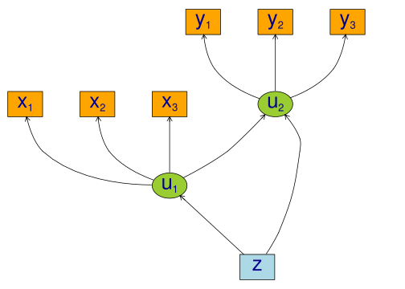
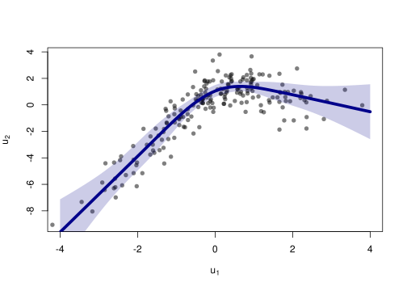
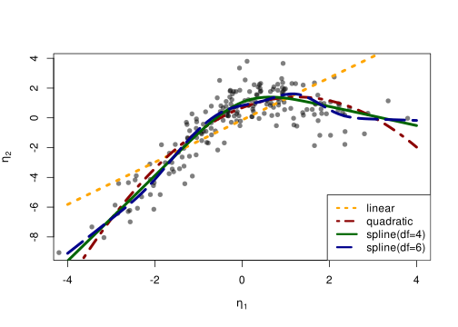
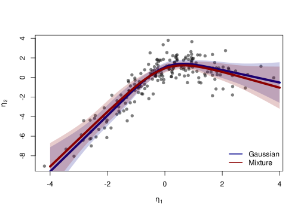

# Non-linear latent variable models and error-in-variable models

``` r

library("lava")
```

We consider the measurement models given by

X\_{j} = u\_{1} + \epsilon\_{j}^{x}, \quad j=1,2,3 Y\_{j} = u\_{2} +
\epsilon\_{j}^{y}, \quad j=1,2,3 and with a structural model given by
u\_{2} = f(u\_{1}) + Z + \zeta\_{2} u\_{1} = Z + \zeta\_{1} with iid
measurement errors
\epsilon\_{j}^{x},\epsilon\_{j}^{y},\zeta\_{1},\zeta\_{2}\sim\mathcal{N}(0,1),
j=1,2,3. and standard normal distributed covariate Z. To simulate from
this model we use the following syntax:

``` r

f <- function(x) cos(1.25*x) + x - 0.25*x^2
m <- lvm(x1+x2+x3 ~ u1, y1+y2+y3 ~ u2, latent=~u1+u2)
regression(m) <- u1+u2 ~ z
functional(m, u2~u1) <- f

d <- sim(m, n=200, seed=42) # Default is all parameters are 1
```

``` r

## plot(m, plot.engine="visNetwork")
plot(m)
```



We refer to ([Holst and Budtz-Jørgensen
2013](#ref-holst_budtzjorgensen_2013)) for details on the syntax for
model specification.

## Estimation

To estimate the parameters using the two-stage estimator described in
([Holst and Budtz-Jørgensen 2020](#ref-holst_budtzjorgensen_2020)), the
first step is now to specify the measurement models

``` r

m1 <- lvm(x1+x2+x3 ~ u1, u1 ~ z, latent=~u1)
m2 <- lvm(y1+y2+y3 ~ u2, u2 ~ z, latent=~u2)
```

Next, we specify a quadratic relationship between the two latent
variables

``` r

nonlinear(m2, type="quadratic") <- u2 ~ u1
```

and the model can then be estimated using the two-stage estimator

``` r

e1 <- twostage(m1, m2, data=d)
e1
```

                        Estimate Std. Error  Z-value   P-value
    Measurements:
       y2~u2             0.97686    0.03450 28.31401    <1e-12
       y3~u2             1.04485    0.03484 29.98771    <1e-12
    Regressions:
       u2~z              0.88513    0.20777  4.26004 2.044e-05
       u2~u1_1           1.14072    0.17410  6.55228 5.667e-11
       u2~u1_2          -0.45055    0.07160 -6.29272  3.12e-10
    Intercepts:
       y2               -0.12198    0.10915 -1.11749    0.2638
       y3               -0.09879    0.10545 -0.93680    0.3489
       u2                0.67814    0.17363  3.90571 9.395e-05
    Residual Variances:
       y1                1.30730    0.17741  7.36879
       y2                1.11056    0.14476  7.67148
       y3                0.80961    0.13201  6.13286
       u2                2.08483    0.28982  7.19352          

We see a clear statistically significant effect of the second order term
(`u2~u1_2`). For comparison we can also estimate the full MLE of the
linear model:

``` r

e0 <- estimate(regression(m1%++%m2, u2~u1), d)
estimate(e0,keep="^u2~[a-z]",regex=TRUE) ## Extract coef. matching reg.ex.
```

          Estimate Std.Err    2.5% 97.5%   P-value
    u2~u1   1.4140  0.2261 0.97086 1.857 4.001e-10
    u2~z    0.6374  0.2778 0.09291 1.182 2.177e-02

Next, we calculate predictions from the quadratic model using the
estimated parameter coefficients
\mathbb{E}\_{\widehat{\theta}\_{2}}(u\_{2} \mid u\_{1}, Z=0),

``` r

newd <- expand.grid(u1=seq(-4, 4, by=0.1), z=0)
pred1 <- predict(e1, newdata=newd, x=TRUE)
head(pred1)
```

                 y1         y2         y3         u2
    [1,] -11.093569 -10.958869 -11.689950 -11.093569
    [2,] -10.623561 -10.499736 -11.198861 -10.623561
    [3,] -10.162565 -10.049406 -10.717187 -10.162565
    [4,]  -9.710579  -9.607878 -10.244928  -9.710579
    [5,]  -9.267605  -9.175153  -9.782084  -9.267605
    [6,]  -8.833641  -8.751230  -9.328656  -8.833641

To obtain a potential better fit we next proceed with a natural cubic
spline

``` r

kn <- seq(-3,3,length.out=5)
nonlinear(m2, type="spline", knots=kn) <- u2 ~ u1
e2 <- twostage(m1, m2, data=d)
e2
```

                        Estimate Std. Error  Z-value   P-value
    Measurements:
       y2~u2             0.97752    0.03455 28.29159    <1e-12
       y3~u2             1.04508    0.03488 29.95874    <1e-12
    Regressions:
       u2~z              0.86729    0.20271  4.27846 1.882e-05
       u2~u1_1           2.86231    0.66635  4.29551 1.743e-05
       u2~u1_2           0.00344    0.09925  0.03468    0.9723
       u2~u1_3          -0.26270    0.28907 -0.90880    0.3635
       u2~u1_4           0.50778    0.34705  1.46315    0.1434
    Intercepts:
       y2               -0.12185    0.10922 -1.11563    0.2646
       y3               -0.09874    0.10545 -0.93638    0.3491
       u2                1.83814    1.63590  1.12362    0.2612
    Residual Variances:
       y1                1.31286    0.17755  7.39415
       y2                1.10412    0.14452  7.63991
       y3                0.81124    0.13183  6.15387
       u2                1.99404    0.26954  7.39799          

Confidence limits can be obtained via the Delta method using the
`estimate` method:

``` r

p <- cbind(u1=newd$u1,
  estimate(e2,f=function(p) predict(e2,p=p,newdata=newd))$coefmat)
head(p)
```

         u1  Estimate   Std.Err      2.5%     97.5%      P-value
    p1 -4.0 -9.611119 1.2667862 -12.09397 -7.128263 3.273732e-14
    p2 -3.9 -9.324887 1.2076275 -11.69179 -6.957981 1.148259e-14
    p3 -3.8 -9.038656 1.1492875 -11.29122 -6.786094 3.703580e-15
    p4 -3.7 -8.752425 1.0918973 -10.89250 -6.612345 1.094274e-15
    p5 -3.6 -8.466193 1.0356149 -10.49596 -6.436425 2.957677e-16
    p6 -3.5 -8.179962 0.9806309 -10.10196 -6.257961 7.333579e-17

The fitted function can be obtained with the following code:

``` r

plot(I(u2-z) ~ u1, data=d, col=Col("black",0.5), pch=16,
     xlab=expression(u[1]), ylab=expression(u[2]), xlim=c(-4,4))
lines(Estimate ~ u1, data=as.data.frame(p), col="darkblue", lwd=5)
confband(p[,1], lower=p[,4], upper=p[,5], polygon=TRUE,
     border=NA, col=Col("darkblue",0.2))
```



## Cross-validation

A more formal comparison of the different models can be obtained by
cross-validation. Here we specify linear, quadratic and cubic spline
models with 4 and 9 degrees of freedom.

``` r

m2a <- nonlinear(m2, type="linear", u2~u1)
m2b <- nonlinear(m2, type="quadratic", u2~u1)
kn1 <- seq(-3,3,length.out=5)
kn2 <- seq(-3,3,length.out=8)
m2c <- nonlinear(m2, type="spline", knots=kn1, u2~u1)
m2d <- nonlinear(m2, type="spline", knots=kn2, u2~u1)
```

To assess the model fit average RMSE is estimated with 5-fold
cross-validation repeated two times

``` r

## Scale models in stage 2 to allow for a fair RMSE comparison
d0 <- d
for (i in endogenous(m2))
    d0[,i] <- scale(d0[,i],center=TRUE,scale=TRUE)
## Repeated 5-fold cross-validation:
ff <- lapply(list(linear=m2a,quadratic=m2b,spline4=m2c,spline6=m2d),
        function(m) function(data,...) twostage(m1,m,data=data,stderr=FALSE,control=list(start=coef(e0),contrain=TRUE)))
fit.cv <- lava:::cv(ff,data=d,K=5,rep=2,mc.cores=parallel::detectCores(),seed=1)
```

``` r

fit.cv$coef
```

                  RMSE
    linear    2.137633
    quadratic 1.806409
    spline4   1.747002
    spline6   1.760917

Here the RMSE is in favour of the splines model with 4 degrees of
freedom:

``` r

fit <- lapply(list(m2a,m2b,m2c,m2d),
         function(x) {
         e <- twostage(m1,x,data=d)
         pr <- cbind(u1=newd$u1,predict(e,newdata=newd$u1,x=TRUE))
         return(list(estimate=e,predict=as.data.frame(pr)))
         })

plot(I(u2-z) ~ u1, data=d, col=Col("black",0.5), pch=16,
     xlab=expression(eta[1]), ylab=expression(eta[2]), xlim=c(-4,4))
col <- c("orange","darkred","darkgreen","darkblue")
lty <- c(3,4,1,5)
for (i in seq_along(fit)) {
    with(fit[[i]]$pr, lines(u2 ~ u1, col=col[i], lwd=4, lty=lty[i]))
}
legend("bottomright",
      c("linear","quadratic","spline(df=4)","spline(df=6)"),
      col=col, lty=lty, lwd=3)
```



For convenience, the function `twostageCV` can be used to do the
cross-validation (also for choosing the mixture distribution via the
`nmix` argument, see the section below). For example,

``` r

set.seed(1)
selmod <- twostageCV(m1, m2, data=d, df=2:4, nmix=1:2,
        nfolds=5, rep=2, mc.cores=parallel::detectCores())
```

applies cross-validation (here just 2 folds for simplicity) to select
the best splines with degrees of freedom varying from 1-3 (the linear
model is automatically included)

``` r

selmod
```

    ────────────────────────────────────────────────────────────────────────────────
    Selected mixture model: 2 components
          AIC1
    1 1961.839
    2 1958.803
    ────────────────────────────────────────────────────────────────────────────────
    Selected spline model degrees of freedom: 4
    Knots: -3.958 -1.968 0.02149 2.011 4.001

         RMSE(nfolds=, rep=)
    df:1            2.135107
    df:2            1.883174
    df:3            1.918419
    df:4            1.860710
    ────────────────────────────────────────────────────────────────────────────────

                        Estimate Std. Error Z-value  P-value   std.xy
    Measurements:
       y1~u2             1.00000                                0.93509
       y2~u2             0.97827  0.03464   28.24162   <1e-12   0.94291
       y3~u2             1.04529  0.03482   30.01847   <1e-12   0.96175
    Regressions:
       u2~z              1.02727  0.22350    4.59637 4.299e-06  0.34701
       u2~u1_1           2.61255  0.90768    2.87827 0.003999   1.13563
       u2~u1_2           0.01368  0.06464    0.21172 0.8323     0.30995
       u2~u1_3          -0.19030  0.17477   -1.08887 0.2762    -1.48970
       u2~u1_4           0.35252  0.19173    1.83864 0.06597    0.52316
    Intercepts:
       y1                0.00000                                0.00000
       y2               -0.12170  0.10925   -1.11391 0.2653    -0.03871
       y3               -0.09870  0.10546   -0.93592 0.3493    -0.02997
       u2                1.54947  2.64289    0.58628 0.5577     0.51136
    Residual Variances:
       y1                1.31890  0.17659    7.46873            0.12560
       y2                1.09634  0.14483    7.56961            0.11093
       y3                0.81386  0.13260    6.13771            0.07504
       u2                1.99292  0.28189    7.06988            0.21706

## Specification of general functional forms

Next, we show how to specify a general functional relation of multiple
different latent or exogenous variables. This is achieved via the
`predict.fun` argument. To illustrate this we include interactions
between the latent variable u\_{1} and a dichotomized version of the
covariate z

``` r

d$g <- (d$z<0)*1 ## Group variable
mm1 <- regression(m1, ~g)  # Add grouping variable as exogenous variable (effect specified via 'predict.fun')
mm2 <- regression(m2, u2~ u1+u2+u1:g+u2:g+z)
pred <- function(mu,var,data,...) {
    cbind("u1"=mu[,1],"u2"=mu[,1]^2+var[1],
      "u1:g"=mu[,1]*data[,"g"],"u2:g"=(mu[,1]^2+var[1])*data[,"g"])
}
ee1 <- twostage(mm1, model2=mm2, data=d, predict.fun=pred)
estimate(ee1,keep="u2~u",regex=TRUE)
```

            Estimate Std.Err     2.5%    97.5%   P-value
    u2~u2     0.4505 0.07379  0.30585  0.59509 1.029e-09
    u2~u1     0.2315 0.12346 -0.01051  0.47344 6.082e-02
    u2~u1:g   0.5926 0.23144  0.13900  1.04624 1.045e-02
    u2~u2:g  -0.1973 0.09662 -0.38668 -0.00792 4.116e-02

A formal test show no statistically significant effect of this
interaction

``` r

summary(estimate(ee1,keep="(:g)", regex=TRUE))
```

    Call: estimate.default(x = ee1, keep = "(:g)", regex = TRUE)
    ────────────────────────────────────────────────────────────
            Estimate Std.Err    2.5%    97.5% P-value
    u2~u1:g   0.5926 0.23144  0.1390  1.04624 0.01045
    u2~u2:g  -0.1973 0.09662 -0.3867 -0.00792 0.04116
    ────────────────────────────────────────────────────────────
    Null Hypothesis:
      [u2~u1:g] = 0
      [u2~u2:g] = 0

    chisq = 24.8244, df = 2, p-value = 4.069e-06

## Mixture models

Lastly, we demonstrate how the distributional assumptions of stage 1
model can be relaxed by letting the conditional distribution of the
latent variable given covariates follow a Gaussian mixture distribution.
The following code explictly defines the parameter constraints of the
model by setting the intercept of the first indicator variable, x\_{1},
to zero and the factor loading parameter of the same variable to one.

``` r

m1 <- baptize(m1)  ## Label all parameters
intercept(m1, ~x1+u1) <- list(0,NA) ## Set intercept of x1 to zero. Remove the label of u1
regression(m1,x1~u1) <- 1 ## Factor loading fixed to 1
```

The mixture model may then be estimated using the `mixture` method
(note, this requires the `mets` package to be installed), where the
Parameter names shared across the different mixture components given in
the `list` will be constrained to be identical in the mixture model.
Thus, only the intercept of u\_{1} is allowed to vary between the
mixtures.

``` r

set.seed(1)
em0 <- mixture(m1, k=2, data=d)
```

To decrease the risk of using a local maximizer of the likelihood we can
rerun the estimation with different random starting values

``` r

em0 <- NULL
ll <- c()
for (i in 1:5) {
  set.seed(i)
  em <- mixture(m1, k=2, data=d, control=list(trace=0))
  ll <- c(ll,logLik(em))
  if (is.null(em0) || logLik(em0)<tail(ll,1))
    em0 <- em
}
```

``` r

summary(em0)
```

    Cluster 1 (n=162, Prior=0.776):
    --------------------------------------------------
                        Estimate Std. Error Z value  Pr(>|z|)
    Measurements:
       x1~u1             1.00000
       x2~u1             0.99581  0.07940   12.54099   <1e-12
       x3~u1             1.06344  0.08436   12.60538   <1e-12
    Regressions:
       u1~z              1.06675  0.08527   12.50987   <1e-12
    Intercepts:
       x1                0.00000
       x2                0.03845  0.09890    0.38884 0.6974
       x3               -0.02549  0.10333   -0.24666 0.8052
       u1                0.20922  0.13162    1.58951 0.1119
    Residual Variances:
       x1                0.98539  0.13316    7.40019
       x2                0.97181  0.13156    7.38694
       x3                1.01316  0.14294    7.08808
       u1                0.29049  0.11130    2.61000

    Cluster 2 (n=38, Prior=0.224):
    --------------------------------------------------
                        Estimate Std. Error Z value  Pr(>|z|)
    Measurements:
       x1~u1             1.00000
       x2~u1             0.99581  0.07940   12.54099   <1e-12
       x3~u1             1.06344  0.08436   12.60538   <1e-12
    Regressions:
       u1~z              1.06675  0.08527   12.50987   <1e-12
    Intercepts:
       x1                0.00000
       x2                0.03845  0.09890    0.38884 0.6974
       x3               -0.02549  0.10333   -0.24666 0.8052
       u1               -1.44297  0.25869   -5.57804 2.432e-08
    Residual Variances:
       x1                0.98539  0.13316    7.40019
       x2                0.97181  0.13156    7.38694
       x3                1.01316  0.14294    7.08808
       u1                0.29049  0.11130    2.61000
    --------------------------------------------------
    AIC= 1958.803
    ||score||^2= 1.330875e-07 

Measured by AIC there is a slight improvement in the model fit using the
mixture model

``` r

e0 <- estimate(m1,data=d)
AIC(e0,em0)
```

        df      AIC
    e0  10 1961.839
    em0 12 1958.803

The spline model may then be estimated as before with the `two-stage`
method

``` r

em2 <- twostage(em0,m2,data=d)
em2
```

                        Estimate Std. Error  Z-value   P-value
    Measurements:
       y2~u2             0.97823    0.03468 28.20649    <1e-12
       y3~u2             1.04530    0.03482 30.02125    <1e-12
    Regressions:
       u2~z              1.02885    0.22334  4.60669 4.091e-06
       u2~u1_1           2.80405    0.64968  4.31603 1.589e-05
       u2~u1_2          -0.02248    0.09846 -0.22832    0.8194
       u2~u1_3          -0.17335    0.28503 -0.60818    0.5431
       u2~u1_4           0.38674    0.33557  1.15250    0.2491
    Intercepts:
       y2               -0.12171    0.10925 -1.11400    0.2653
       y3               -0.09870    0.10546 -0.93588    0.3493
       u2                2.12356    1.64075  1.29426    0.1956
    Residual Variances:
       y1                1.31872    0.17659  7.46752
       y2                1.09691    0.14500  7.56501
       y3                0.81345    0.13256  6.13625
       u2                1.99591    0.28314  7.04913          

In this example the results are very similar to the Gaussian model:

``` r

plot(I(u2-z) ~ u1, data=d, col=Col("black",0.5), pch=16,
     xlab=expression(eta[1]), ylab=expression(eta[2]))

lines(Estimate ~ u1, data=as.data.frame(p), col="darkblue", lwd=5)
confband(p[,1], lower=p[,4], upper=p[,5], polygon=TRUE,
     border=NA, col=Col("darkblue",0.2))

pm <- cbind(u1=newd$u1,
        estimate(em2, f=function(p) predict(e2,p=p,newdata=newd))$coefmat)
lines(Estimate ~ u1, data=as.data.frame(pm), col="darkred", lwd=5)
confband(pm[,1], lower=pm[,4], upper=pm[,5], polygon=TRUE,
     border=NA, col=Col("darkred",0.2))
legend("bottomright", c("Gaussian","Mixture"),
       col=c("darkblue","darkred"), lwd=2, bty="n")
```



## SessionInfo

``` r

sessionInfo()
```

    R version 4.6.1 (2026-06-24)
    Platform: x86_64-pc-linux-gnu
    Running under: Ubuntu 24.04.5 LTS

    Matrix products: default
    BLAS:   /usr/lib/x86_64-linux-gnu/openblas-pthread/libblas.so.3
    LAPACK: /usr/lib/x86_64-linux-gnu/openblas-pthread/libopenblasp-r0.3.26.so;  LAPACK version 3.12.0

    locale:
     [1] LC_CTYPE=C.UTF-8       LC_NUMERIC=C           LC_TIME=C.UTF-8
     [4] LC_COLLATE=C.UTF-8     LC_MONETARY=C.UTF-8    LC_MESSAGES=C.UTF-8
     [7] LC_PAPER=C.UTF-8       LC_NAME=C              LC_ADDRESS=C
    [10] LC_TELEPHONE=C         LC_MEASUREMENT=C.UTF-8 LC_IDENTIFICATION=C

    time zone: UTC
    tzcode source: system (glibc)

    attached base packages:
    [1] stats     graphics  grDevices utils     datasets  methods   base

    other attached packages:
    [1] lava_1.9.3.9000

    loaded via a namespace (and not attached):
     [1] mets_1.3.12            cli_3.6.6              knitr_1.52
     [4] rlang_1.3.0            xfun_0.61              otel_0.2.0
     [7] generics_0.1.4         jsonlite_2.0.0         future.apply_1.20.2
    [10] listenv_1.1.0          htmltools_0.5.9        graph_1.90.0
    [13] stats4_4.6.1           rmarkdown_2.32         grid_4.6.1
    [16] evaluate_1.0.5         fastmap_1.2.0          mvtnorm_1.4-2
    [19] numDeriv_2016.8-1.1    yaml_2.3.12            timereg_2.0.7
    [22] compiler_4.6.1         codetools_0.2-20       Rcpp_1.1.2
    [25] future_1.76.0          Rgraphviz_2.56.0       lattice_0.22-9
    [28] digest_0.6.39          parallelly_1.48.0      parallel_4.6.1
    [31] splines_4.6.1          Matrix_1.7-5           RcppArmadillo_15.6.0-1
    [34] tools_4.6.1            globals_0.19.1         survival_3.8-6
    [37] BiocGenerics_0.58.1   

## Bibliography

Holst, K. K., and E. Budtz-Jørgensen. 2013. “Linear Latent Variable
Models: The Lava-Package.” *Computational Statistics* 28 (4): 1385–452.
<https://doi.org/10.1007/s00180-012-0344-y>.

Holst, Klaus Kähler, and Esben Budtz-Jørgensen. 2020. “A Two-Stage
Estimation Procedure for Non-Linear Structural Equation Models.”
*Biostatistics* (in press).
<https://doi.org/10.1093/biostatistics/kxy082>.
