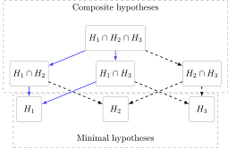

# Closed testing procedure

Given p hypotheses \\H_1, \ldots, H_p\\ all \\2^p-1\\ intersection
hypotheses are calculated and adjusted p-values are obtained for \\H_j\\
is calculated as the max p-value of all intersection hypotheses
containing Hj. Example, for p=3, the adjusted p-value for \\H_1\\ will
be obtained from \\\\(H1, H2, H3), (H1,H2), (H1,H3), (H1)\\\\.

## Usage

``` r
closed_testing(object, test = test_wald, ...)
```

## Arguments

- object:

  `estimate` object

- test:

  function that conducts hypothesis test. See details below.

- ...:

  Additional arguments passed to `test`

## Details



The function `test` should be a function `function(object, index, ...)`
which as its first argument takes an `estimate` object and with an
argument `index` which is a integer vector specifying which
subcomponents of `object` to test. The ellipsis argument can be any
other arguments used in the test function. The function
[`test_wald()`](https://kkholst.github.io/lava/reference/compare.md) is
an example of valid test function (which has an additional argument
`null` in reference to the above mentioned ellipsis arguments).

## References

Marcus, R; Peritz, E; Gabriel, KR (1976). "On closed testing procedures
with special reference to ordered analysis of variance". Biometrika. 63
(3): 655–660.

## Examples

``` r
m <- lvm()
regression(m, c(y1,y2,y3,y4)~x) <- c(0, 0.25, 0, 0.25)
regression(m, to=endogenous(m), from="u") <- 1
variance(m,endogenous(m)) <- 1
set.seed(1)
d <- sim(m, 200)
l1 <- lm(y1~x,d)
l2 <- lm(y2~x,d)
l3 <- lm(y3~x,d)
l4 <- lm(y4~x,d)

(a <- merge(l1, l2, l3, l4, subset=2))
#>     Estimate Std.Err     2.5%  97.5% P-value
#> x   -0.04472 0.08929 -0.21971 0.1303 0.61650
#> ───                                         
#> x.1  0.23835 0.09337  0.05536 0.4213 0.01068
#> ───                                         
#> x.2 -0.04900 0.09372 -0.23269 0.1347 0.60111
#> ───                                         
#> x.3  0.22272 0.09225  0.04191 0.4035 0.01577
if (requireNamespace("mets",quietly=TRUE)) {
   alpha_zmax(a)
}
#>        Estimate    P-value Adj.P-value
#> x   -0.04471577 0.61649927  0.96215399
#> x.1  0.23835177 0.01068488  0.03639110
#> x.2 -0.04899862 0.60110873  0.95610026
#> x.3  0.22271748 0.01576576  0.05254759
#> attr(,"adjusted.significance.level")
#> [1] 0.01486995
adj <- closed_testing(a)
adj
#> Call: closed_testing(object = a)
#> 
#>        Estimate      adj.p
#> x   -0.04471577 0.84238106
#> x.1  0.23835177 0.01928037
#> x.2 -0.04899862 0.84238106
#> x.3  0.22271748 0.01928037
adj$p.value
#>          x        x.1        x.2        x.3 
#> 0.84238106 0.01928037 0.84238106 0.01928037 
summary(adj)
#> Call: closed_testing(object = a)
#> 
#> ── Adjusted p-values ──
#> 
#>        Estimate      adj.p
#> x   -0.04471577 0.84238106
#> x.1  0.23835177 0.01928037
#> x.2 -0.04899862 0.84238106
#> x.3  0.22271748 0.01928037
#> 
#> ── Raw p-values for intersection hypotheses ──
#> 
#> 1-way intersections:
#>   {x}                                      p = 0.6165
#>   {x.1}                                    p = 0.0107
#>   {x.2}                                    p = 0.6011
#>   {x.3}                                    p = 0.0158
#> 
#> 2-way intersections:
#>   {x, x.1}                                 p = 0.0036
#>   {x, x.2}                                 p = 0.8424
#>   {x, x.3}                                 p = 0.0086
#>   {x.1, x.2}                               p = 0.0032
#>   {x.1, x.3}                               p = 0.0193
#>   {x.2, x.3}                               p = 0.0046
#> 
#> 3-way intersections:
#>   {x, x.1, x.2}                            p = 0.0033
#>   {x, x.1, x.3}                            p = 0.0022
#>   {x, x.2, x.3}                            p = 0.0068
#>   {x.1, x.2, x.3}                          p = 0.0012
#> 
#> 4-way intersections:
#>   {x, x.1, x.2, x.3}                       p = 0.0006
#> 
```
